```python
# ==========================================================
# 1. Imports
# ==========================================================

import pandas as pd
import numpy as np

import matplotlib.pyplot as plt
import seaborn as sns

from IPython.display import display

# Plot settings
plt.style.use("ggplot")
sns.set_theme(style="whitegrid")

# Display settings
pd.set_option("display.max_columns", None)
pd.set_option("display.max_rows", 100)

print("Libraries imported successfully.")
```

    Libraries imported successfully.
    


```python
df = pd.read_csv(
    r"C:\Users\trish\OneDrive - University of Bristol\summer project\TS\Data\active_lives_london_all_years_decoded.csv"
)

print(df.shape)
display(df.head())
```

    C:\Users\trish\AppData\Local\Temp\ipykernel_22120\3627101011.py:1: DtypeWarning: Columns (2,4,8,9,53,69,85,100,293,294,295,296,297,298,299,300,301,302,303,305,306,307,308,309,310,311,319,322,324,325,326,330,331,332,333,337,344,347,349,350,351,355,356,357,358,362,369,372,374,375,376,380,381,382,383,418,419,420,421,422,424,425,426,427,428,429,430,431,432,433,434,435,436,437,438,439,440,441,442,443,444,445,446,447,448,449,450,451,452,453,454,455,456,457,458,459,460,461,462,463,481,482,483,484,485,486,487,488,489,490,491,492,493,494,495,496,497,498,500,509,521,522,529,530,531,532,533,534,535,536,537,538,539,540,541,542,543,544,545,546,547,548,549,550,551,552,553,554,555,556,557,558,578,579,580,581,582,583,584,585,586,587,588,589,590,591,592,593,594,595,596,597,598,599,600,601,602,603,604,605,606,607,608,609) have mixed types. Specify dtype option on import or set low_memory=False.
      df = pd.read_csv(
    

    (135497, 610)
    


<div>
<style scoped>
    .dataframe tbody tr th:only-of-type {
        vertical-align: middle;
    }

    .dataframe tbody tr th {
        vertical-align: top;
    }

    .dataframe thead th {
        text-align: right;
    }
</style>
<table border="1" class="dataframe">
  <thead>
    <tr style="text-align: right;">
      <th></th>
      <th>serial</th>
      <th>mode</th>
      <th>group</th>
      <th>Quarter</th>
      <th>MonthTwelve</th>
      <th>wt_final</th>
      <th>xStrata</th>
      <th>LA_code</th>
      <th>LA_2023</th>
      <th>LA_Old</th>
      <th>Age5_2</th>
      <th>Age9</th>
      <th>Disab2_POP</th>
      <th>Disab3</th>
      <th>disty1_POP</th>
      <th>disty10_POP</th>
      <th>disty2_POP</th>
      <th>disty3_POP</th>
      <th>disty4_POP</th>
      <th>disty5_POP</th>
      <th>disty6_POP</th>
      <th>disty7_POP</th>
      <th>disty8_POP</th>
      <th>disty9_POP</th>
      <th>Educ6</th>
      <th>Eth2</th>
      <th>Eth7</th>
      <th>EthAge4</th>
      <th>Gend3</th>
      <th>GendAge9</th>
      <th>NSSEC5</th>
      <th>NSSEC8</th>
      <th>BMIG</th>
      <th>MEMS7_ALL</th>
      <th>MEMS7GR_ALL</th>
      <th>MEMS7_SPORTCOUNT_A01</th>
      <th>MEMS7GR_SPORTCOUNT_A01</th>
      <th>MEMS7GR7_SPORTCOUNT_A01</th>
      <th>MONTHS_12_WALKLEISURE_B01</th>
      <th>DAYS10P_WALKLEISURE_B01</th>
      <th>DAYS10P60_WALKLEISURE_B01</th>
      <th>DAYS10P60GR_WALKLEISURE_B01</th>
      <th>MEMS7_CAPPED_WALKLEISURE_B01</th>
      <th>ACTYRA_WALKLEISURE_B01</th>
      <th>ACTYRB_WALKLEISURE_B01</th>
      <th>ACTYRC_WALKLEISURE_B01</th>
      <th>FREQUENCY_WALKLEISURE_B01</th>
      <th>DURATION_WALKLEISURE_B01</th>
      <th>MEMS7_WALKLEISURE_B01</th>
      <th>FREQUENCYGR_WALKLEISURE_B01</th>
      <th>DURATIONGR_WALKLEISURE_B01</th>
      <th>DURATION1PL_WALKLEISURE_B01</th>
      <th>MEMS7GR_WALKLEISURE_B01</th>
      <th>DAYS10PGR2_WALKLEISURE_B01</th>
      <th>MONTHS_12_WALKTRAV_B02</th>
      <th>DAYS10P_WALKTRAV_B02</th>
      <th>DAYS10P60_WALKTRAV_B02</th>
      <th>DAYS10P60GR_WALKTRAV_B02</th>
      <th>MEMS7_CAPPED_WALKTRAV_B02</th>
      <th>ACTYRA_WALKTRAV_B02</th>
      <th>ACTYRB_WALKTRAV_B02</th>
      <th>ACTYRC_WALKTRAV_B02</th>
      <th>FREQUENCY_WALKTRAV_B02</th>
      <th>DURATION_WALKTRAV_B02</th>
      <th>MEMS7_WALKTRAV_B02</th>
      <th>FREQUENCYGR_WALKTRAV_B02</th>
      <th>DURATIONGR_WALKTRAV_B02</th>
      <th>DURATION1PL_WALKTRAV_B02</th>
      <th>MEMS7GR_WALKTRAV_B02</th>
      <th>DAYS10PGR2_WALKTRAV_B02</th>
      <th>MONTHS_12_CYCTRAV_B04</th>
      <th>DAYS10P_CYCTRAV_B04</th>
      <th>DAYS10P60_CYCTRAV_B04</th>
      <th>DAYS10P60GR_CYCTRAV_B04</th>
      <th>MEMS7_CAPPED_CYCTRAV_B04</th>
      <th>ACTYRA_CYCTRAV_B04</th>
      <th>ACTYRB_CYCTRAV_B04</th>
      <th>ACTYRC_CYCTRAV_B04</th>
      <th>FREQUENCY_CYCTRAV_B04</th>
      <th>DURATION_CYCTRAV_B04</th>
      <th>MEMS7_CYCTRAV_B04</th>
      <th>FREQUENCYGR_CYCTRAV_B04</th>
      <th>DURATIONGR_CYCTRAV_B04</th>
      <th>DURATION1PL_CYCTRAV_B04</th>
      <th>MEMS7GR_CYCTRAV_B04</th>
      <th>DAYS10PGR2_CYCTRAV_B04</th>
      <th>MONTHS_12_DANCEART_B05</th>
      <th>DAYS10P_DANCEART_B05</th>
      <th>DAYS10P60_DANCEART_B05</th>
      <th>DAYS10P60GR_DANCEART_B05</th>
      <th>ACTYRA_DANCEART_B05</th>
      <th>ACTYRB_DANCEART_B05</th>
      <th>ACTYRC_DANCEART_B05</th>
      <th>FREQUENCY_DANCEART_B05</th>
      <th>DURATION_DANCEART_B05</th>
      <th>MEMS7_DANCEART_B05</th>
      <th>FREQUENCYGR_DANCEART_B05</th>
      <th>DURATIONGR_DANCEART_B05</th>
      <th>DURATION1PL_DANCEART_B05</th>
      <th>MEMS7GR_DANCEART_B05</th>
      <th>DAYS10PGR2_DANCEART_B05</th>
      <th>MONTHS_12_SPORTTRAD_B07</th>
      <th>DAYS10P_SPORTTRAD_B07</th>
      <th>DAYS10P60_SPORTTRAD_B07</th>
      <th>DAYS10P60GR_SPORTTRAD_B07</th>
      <th>ACTYRA_SPORTTRAD_B07</th>
      <th>ACTYRB_SPORTTRAD_B07</th>
      <th>ACTYRC_SPORTTRAD_B07</th>
      <th>FREQUENCY_SPORTTRAD_B07</th>
      <th>DURATION_SPORTTRAD_B07</th>
      <th>MEMS7_SPORTTRAD_B07</th>
      <th>FREQUENCYGR_SPORTTRAD_B07</th>
      <th>DURATIONGR_SPORTTRAD_B07</th>
      <th>DURATION1PL_SPORTTRAD_B07</th>
      <th>MEMS7GR_SPORTTRAD_B07</th>
      <th>MONTHS_12_WALKALL_C01</th>
      <th>DAYS10P_WALKALL_C01</th>
      <th>DAYS10P60_WALKALL_C01</th>
      <th>DAYS10P60GR_WALKALL_C01</th>
      <th>MEMS7_CAPPED_WALKALL_C01</th>
      <th>ACTYRA_WALKALL_C01</th>
      <th>ACTYRB_WALKALL_C01</th>
      <th>ACTYRC_WALKALL_C01</th>
      <th>FREQUENCY_WALKALL_C01</th>
      <th>DURATION_WALKALL_C01</th>
      <th>MEMS7_WALKALL_C01</th>
      <th>FREQUENCYGR_WALKALL_C01</th>
      <th>DURATIONGR_WALKALL_C01</th>
      <th>DURATION1PL_WALKALL_C01</th>
      <th>MEMS7GR_WALKALL_C01</th>
      <th>MONTHS_12_ACTTRAV_C03</th>
      <th>DAYS10P_ACTTRAV_C03</th>
      <th>DAYS10P60_ACTTRAV_C03</th>
      <th>DAYS10P60GR_ACTTRAV_C03</th>
      <th>MEMS7_CAPPED_ACTTRAV_C03</th>
      <th>ACTYRA_ACTTRAV_C03</th>
      <th>ACTYRB_ACTTRAV_C03</th>
      <th>ACTYRC_ACTTRAV_C03</th>
      <th>FREQUENCY_ACTTRAV_C03</th>
      <th>DURATION_ACTTRAV_C03</th>
      <th>MEMS7_ACTTRAV_C03</th>
      <th>FREQUENCYGR_ACTTRAV_C03</th>
      <th>DURATIONGR_ACTTRAV_C03</th>
      <th>DURATION1PL_ACTTRAV_C03</th>
      <th>MEMS7GR_ACTTRAV_C03</th>
      <th>MONTHS_12_DANCEALL_C04</th>
      <th>DAYS10P_DANCEALL_C04</th>
      <th>DAYS10P60_DANCEALL_C04</th>
      <th>DAYS10P60GR_DANCEALL_C04</th>
      <th>ACTYRA_DANCEALL_C04</th>
      <th>ACTYRB_DANCEALL_C04</th>
      <th>ACTYRC_DANCEALL_C04</th>
      <th>FREQUENCY_DANCEALL_C04</th>
      <th>DURATION_DANCEALL_C04</th>
      <th>MEMS7_DANCEALL_C04</th>
      <th>FREQUENCYGR_DANCEALL_C04</th>
      <th>DURATIONGR_DANCEALL_C04</th>
      <th>DURATION1PL_DANCEALL_C04</th>
      <th>MEMS7GR_DANCEALL_C04</th>
      <th>MONTHS_12_TEAMSPORT_C05</th>
      <th>DAYS10P_TEAMSPORT_C05</th>
      <th>DAYS10P60_TEAMSPORT_C05</th>
      <th>DAYS10P60GR_TEAMSPORT_C05</th>
      <th>ACTYRA_TEAMSPORT_C05</th>
      <th>ACTYRB_TEAMSPORT_C05</th>
      <th>ACTYRC_TEAMSPORT_C05</th>
      <th>FREQUENCY_TEAMSPORT_C05</th>
      <th>DURATION_TEAMSPORT_C05</th>
      <th>MEMS7_TEAMSPORT_C05</th>
      <th>FREQUENCYGR_TEAMSPORT_C05</th>
      <th>DURATIONGR_TEAMSPORT_C05</th>
      <th>DURATION1PL_TEAMSPORT_C05</th>
      <th>MEMS7GR_TEAMSPORT_C05</th>
      <th>MINS_SESS_TEAMSPORT_C05</th>
      <th>MONTHS_12_RACKETSPORT_C06</th>
      <th>DAYS10P_RACKETSPORT_C06</th>
      <th>DAYS10P60_RACKETSPORT_C06</th>
      <th>DAYS10P60GR_RACKETSPORT_C06</th>
      <th>ACTYRA_RACKETSPORT_C06</th>
      <th>ACTYRB_RACKETSPORT_C06</th>
      <th>ACTYRC_RACKETSPORT_C06</th>
      <th>FREQUENCY_RACKETSPORT_C06</th>
      <th>DURATION_RACKETSPORT_C06</th>
      <th>MEMS7_RACKETSPORT_C06</th>
      <th>FREQUENCYGR_RACKETSPORT_C06</th>
      <th>DURATIONGR_RACKETSPORT_C06</th>
      <th>DURATION1PL_RACKETSPORT_C06</th>
      <th>MEMS7GR_RACKETSPORT_C06</th>
      <th>MONTHS_12_ADVWATERSPORT_C07</th>
      <th>DAYS10P_ADVWATERSPORT_C07</th>
      <th>DAYS10P60_ADVWATERSPORT_C07</th>
      <th>DAYS10P60GR_ADVWATERSPORT_C07</th>
      <th>ACTYRA_ADVWATERSPORT_C07</th>
      <th>ACTYRB_ADVWATERSPORT_C07</th>
      <th>ACTYRC_ADVWATERSPORT_C07</th>
      <th>FREQUENCY_ADVWATERSPORT_C07</th>
      <th>DURATION_ADVWATERSPORT_C07</th>
      <th>MEMS7_ADVWATERSPORT_C07</th>
      <th>FREQUENCYGR_ADVWATERSPORT_C07</th>
      <th>DURATIONGR_ADVWATERSPORT_C07</th>
      <th>DURATION1PL_ADVWATERSPORT_C07</th>
      <th>MEMS7GR_ADVWATERSPORT_C07</th>
      <th>MONTHS_12_LEISURE_C08</th>
      <th>DAYS10P_LEISURE_C08</th>
      <th>DAYS10P60_LEISURE_C08</th>
      <th>DAYS10P60GR_LEISURE_C08</th>
      <th>ACTYRA_LEISURE_C08</th>
      <th>ACTYRB_LEISURE_C08</th>
      <th>ACTYRC_LEISURE_C08</th>
      <th>FREQUENCY_LEISURE_C08</th>
      <th>DURATION_LEISURE_C08</th>
      <th>MEMS7_LEISURE_C08</th>
      <th>FREQUENCYGR_LEISURE_C08</th>
      <th>DURATIONGR_LEISURE_C08</th>
      <th>DURATION1PL_LEISURE_C08</th>
      <th>MEMS7GR_LEISURE_C08</th>
      <th>MONTHS_12_COMBATTARGET_C09</th>
      <th>DAYS10P_COMBATTARGET_C09</th>
      <th>DAYS10P60_COMBATTARGET_C09</th>
      <th>DAYS10P60GR_COMBATTARGET_C09</th>
      <th>ACTYRA_COMBATTARGET_C09</th>
      <th>ACTYRB_COMBATTARGET_C09</th>
      <th>ACTYRC_COMBATTARGET_C09</th>
      <th>FREQUENCY_COMBATTARGET_C09</th>
      <th>DURATION_COMBATTARGET_C09</th>
      <th>MEMS7_COMBATTARGET_C09</th>
      <th>FREQUENCYGR_COMBATTARGET_C09</th>
      <th>DURATIONGR_COMBATTARGET_C09</th>
      <th>DURATION1PL_COMBATTARGET_C09</th>
      <th>MEMS7GR_COMBATTARGET_C09</th>
      <th>MONTHS_12_ADVENTURE_D01</th>
      <th>DAYS10P_ADVENTURE_D01</th>
      <th>DAYS10P60_ADVENTURE_D01</th>
      <th>DAYS10P60GR_ADVENTURE_D01</th>
      <th>ACTYRA_ADVENTURE_D01</th>
      <th>ACTYRB_ADVENTURE_D01</th>
      <th>ACTYRC_ADVENTURE_D01</th>
      <th>FREQUENCY_ADVENTURE_D01</th>
      <th>DURATION_ADVENTURE_D01</th>
      <th>MEMS7_ADVENTURE_D01</th>
      <th>FREQUENCYGR_ADVENTURE_D01</th>
      <th>DURATIONGR_ADVENTURE_D01</th>
      <th>DURATION1PL_ADVENTURE_D01</th>
      <th>MEMS7GR_ADVENTURE_D01</th>
      <th>MONTHS_12_WATERSPORTS_D02</th>
      <th>DAYS10P_WATERSPORTS_D02</th>
      <th>DAYS10P60_WATERSPORTS_D02</th>
      <th>DAYS10P60GR_WATERSPORTS_D02</th>
      <th>ACTYRA_WATERSPORTS_D02</th>
      <th>ACTYRB_WATERSPORTS_D02</th>
      <th>ACTYRC_WATERSPORTS_D02</th>
      <th>FREQUENCY_WATERSPORTS_D02</th>
      <th>DURATION_WATERSPORTS_D02</th>
      <th>MEMS7_WATERSPORTS_D02</th>
      <th>FREQUENCYGR_WATERSPORTS_D02</th>
      <th>DURATIONGR_WATERSPORTS_D02</th>
      <th>DURATION1PL_WATERSPORTS_D02</th>
      <th>MEMS7GR_WATERSPORTS_D02</th>
      <th>MONTHS_12_ATHLETICS_D03</th>
      <th>DAYS10P_ATHLETICS_D03</th>
      <th>DAYS10P60_ATHLETICS_D03</th>
      <th>DAYS10P60GR_ATHLETICS_D03</th>
      <th>ACTYRA_ATHLETICS_D03</th>
      <th>ACTYRB_ATHLETICS_D03</th>
      <th>ACTYRC_ATHLETICS_D03</th>
      <th>FREQUENCY_ATHLETICS_D03</th>
      <th>DURATION_ATHLETICS_D03</th>
      <th>MEMS7_ATHLETICS_D03</th>
      <th>FREQUENCYGR_ATHLETICS_D03</th>
      <th>DURATIONGR_ATHLETICS_D03</th>
      <th>DURATION1PL_ATHLETICS_D03</th>
      <th>MEMS7GR_ATHLETICS_D03</th>
      <th>FREQUENCY_WALKALL_NOHILL_D06</th>
      <th>FREQUENCY_CYCWALK_NOEXBIKE_D07</th>
      <th>FREQUENCY_CYCWALK_NOHILLEXBIKE_D08</th>
      <th>DURATION_CYCALL_NOEXBIKE_D05</th>
      <th>DURATION_WALKALL_NOHILL_D06</th>
      <th>DURATION_CYCWALK_NOEXBIKE_D07</th>
      <th>DURATION_CYCWALK_NOHILLEXBIKE_D08</th>
      <th>FREQUENCY_CYCWALK_LEISURE_D09</th>
      <th>DURATION_CYCWALK_LEISURE_D09</th>
      <th>FREQUENCYGR_CYCALL_NOEXBIKE_D05</th>
      <th>FREQUENCYGR_WALKALL_NOHILL_D06</th>
      <th>FREQUENCYGR_CYCWALK_NOEXBIKE_D07</th>
      <th>FREQUENCYGR_CYCWALK_NOHILLEXBIKE_D08</th>
      <th>FREQUENCYGR_CYCWALK_LEISURE_D09</th>
      <th>DURATIONGR_CYCALL_NOEXBIKE_D05</th>
      <th>DURATIONGR_WALKALL_NOHILL_D06</th>
      <th>DURATIONGR_CYCWALK_NOEXBIKE_D07</th>
      <th>DURATIONGR_CYCWALK_NOHILLEXBIKE_D08</th>
      <th>DURATIONGR_CYCWALK_LEISURE_D09</th>
      <th>survey_year</th>
      <th>borough</th>
      <th>month</th>
      <th>LA_2021</th>
      <th>VolAny</th>
      <th>VolFrqB_Pop</th>
      <th>volint1_vol</th>
      <th>volint2_vol</th>
      <th>volint3_vol</th>
      <th>volint4_vol</th>
      <th>volint5_vol</th>
      <th>volint6_vol</th>
      <th>volint7_vol</th>
      <th>VolCnt</th>
      <th>VolCnt_GR2</th>
      <th>Motiva_POP</th>
      <th>motivb_POP</th>
      <th>motivc_POP</th>
      <th>motivd_POP</th>
      <th>READYAB1_POP</th>
      <th>READYOP1_POP</th>
      <th>Number_Activities_150</th>
      <th>DUR_LHT_WALKLEISURE_B01</th>
      <th>DUR_MOD_WALKLEISURE_B01</th>
      <th>DUR_HVY_WALKLEISURE_B01</th>
      <th>DUR_LHT_WALKTRAV_B02</th>
      <th>DUR_MOD_WALKTRAV_B02</th>
      <th>DUR_HVY_WALKTRAV_B02</th>
      <th>MONTHS_12_CYCLEISSPORT_B03</th>
      <th>DAYS10P_CYCLEISSPORT_B03</th>
      <th>DAYS10P60_CYCLEISSPORT_B03</th>
      <th>DAYS10P60GR_CYCLEISSPORT_B03</th>
      <th>MEMS7_CAPPED_CYCLEISSPORT_B03</th>
      <th>ACTYRA_CYCLEISSPORT_B03</th>
      <th>ACTYRB_CYCLEISSPORT_B03</th>
      <th>ACTYRC_CYCLEISSPORT_B03</th>
      <th>FREQUENCY_CYCLEISSPORT_B03</th>
      <th>DURATION_CYCLEISSPORT_B03</th>
      <th>MEMS7_CYCLEISSPORT_B03</th>
      <th>FREQUENCYGR_CYCLEISSPORT_B03</th>
      <th>DURATIONGR_CYCLEISSPORT_B03</th>
      <th>DURATION1PL_CYCLEISSPORT_B03</th>
      <th>MEMS7GR_CYCLEISSPORT_B03</th>
      <th>DUR_LHT_CYCLEISSPORT_B03</th>
      <th>DUR_MOD_CYCLEISSPORT_B03</th>
      <th>DUR_HVY_CYCLEISSPORT_B03</th>
      <th>DAYS10PGR2_CYCLEISSPORT_B03</th>
      <th>DUR_LHT_CYCTRAV_B04</th>
      <th>DUR_MOD_CYCTRAV_B04</th>
      <th>DUR_HVY_CYCTRAV_B04</th>
      <th>DUR_LHT_DANCEART_B05</th>
      <th>DUR_MOD_DANCEART_B05</th>
      <th>DUR_HVY_DANCEART_B05</th>
      <th>MONTHS_12_FITNESS_B06</th>
      <th>DAYS10P_FITNESS_B06</th>
      <th>DAYS10P60_FITNESS_B06</th>
      <th>DAYS10P60GR_FITNESS_B06</th>
      <th>MEMS7_CAPPED_FITNESS_B06</th>
      <th>ACTYRA_FITNESS_B06</th>
      <th>ACTYRB_FITNESS_B06</th>
      <th>ACTYRC_FITNESS_B06</th>
      <th>FREQUENCY_FITNESS_B06</th>
      <th>DURATION_FITNESS_B06</th>
      <th>MEMS7_FITNESS_B06</th>
      <th>FREQUENCYGR_FITNESS_B06</th>
      <th>DURATIONGR_FITNESS_B06</th>
      <th>DURATION1PL_FITNESS_B06</th>
      <th>MEMS7GR_FITNESS_B06</th>
      <th>DUR_LHT_FITNESS_B06</th>
      <th>DUR_MOD_FITNESS_B06</th>
      <th>DUR_HVY_FITNESS_B06</th>
      <th>DAYS10PGR2_FITNESS_B06</th>
      <th>DUR_LHT_SPORTTRAD_B07</th>
      <th>DUR_MOD_SPORTTRAD_B07</th>
      <th>DUR_HVY_SPORTTRAD_B07</th>
      <th>DUR_LHT_WALKALL_C01</th>
      <th>DUR_MOD_WALKALL_C01</th>
      <th>DUR_HVY_WALKALL_C01</th>
      <th>MONTHS_12_CYCALL_C02</th>
      <th>DAYS10P_CYCALL_C02</th>
      <th>DAYS10P60_CYCALL_C02</th>
      <th>DAYS10P60GR_CYCALL_C02</th>
      <th>MEMS7_CAPPED_CYCALL_C02</th>
      <th>ACTYRA_CYCALL_C02</th>
      <th>ACTYRB_CYCALL_C02</th>
      <th>ACTYRC_CYCALL_C02</th>
      <th>FREQUENCY_CYCALL_C02</th>
      <th>DURATION_CYCALL_C02</th>
      <th>MEMS7_CYCALL_C02</th>
      <th>FREQUENCYGR_CYCALL_C02</th>
      <th>DURATIONGR_CYCALL_C02</th>
      <th>DURATION1PL_CYCALL_C02</th>
      <th>MEMS7GR_CYCALL_C02</th>
      <th>DUR_LHT_CYCALL_C02</th>
      <th>DUR_MOD_CYCALL_C02</th>
      <th>DUR_HVY_CYCALL_C02</th>
      <th>DUR_LHT_ACTTRAV_C03</th>
      <th>DUR_MOD_ACTTRAV_C03</th>
      <th>DUR_HVY_ACTTRAV_C03</th>
      <th>DUR_LHT_DANCEALL_C04</th>
      <th>DUR_MOD_DANCEALL_C04</th>
      <th>DUR_HVY_DANCEALL_C04</th>
      <th>DUR_LHT_TEAMSPORT_C05</th>
      <th>DUR_MOD_TEAMSPORT_C05</th>
      <th>DUR_HVY_TEAMSPORT_C05</th>
      <th>DUR_LHT_RACKETSPORT_C06</th>
      <th>DUR_MOD_RACKETSPORT_C06</th>
      <th>DUR_HVY_RACKETSPORT_C06</th>
      <th>DUR_LHT_ADVWATERSPORT_C07</th>
      <th>DUR_MOD_ADVWATERSPORT_C07</th>
      <th>DUR_HVY_ADVWATERSPORT_C07</th>
      <th>DUR_LHT_LEISURE_C08</th>
      <th>DUR_MOD_LEISURE_C08</th>
      <th>DUR_HVY_LEISURE_C08</th>
      <th>DUR_LHT_COMBATTARGET_C09</th>
      <th>DUR_MOD_COMBATTARGET_C09</th>
      <th>DUR_HVY_COMBATTARGET_C09</th>
      <th>DUR_LHT_ADVENTURE_D01</th>
      <th>DUR_MOD_ADVENTURE_D01</th>
      <th>DUR_HVY_ADVENTURE_D01</th>
      <th>DUR_LHT_WATERSPORTS_D02</th>
      <th>DUR_MOD_WATERSPORTS_D02</th>
      <th>DUR_HVY_WATERSPORTS_D02</th>
      <th>DUR_LHT_ATHLETICS_D03</th>
      <th>DUR_MOD_ATHLETICS_D03</th>
      <th>DUR_HVY_ATHLETICS_D03</th>
      <th>DAYS10P_EXBIKE_CYCLECLASS_D04</th>
      <th>Number_Activities_Gr2</th>
      <th>Number_Activities_150_Gr2</th>
      <th>Number_Activities_Gr5</th>
      <th>Number_Activities_150_Gr5</th>
      <th>Club_ExcFitness</th>
      <th>Number_Club</th>
      <th>Number_Club_Gr2</th>
      <th>CLUB_SPORTCOUNT_A01</th>
      <th>CLUB_SPORTFUND_A02</th>
      <th>CLUB_SPORTPRE2016_A03</th>
      <th>CLUB_WALKLEISURE_B01</th>
      <th>CLUB_CYCLEISSPORT_B03</th>
      <th>CLUB_DANCEART_B05</th>
      <th>CLUB_FITNESS_B06</th>
      <th>CLUB_SPORTTRAD_B07</th>
      <th>CLUB_WALKALL_C01</th>
      <th>CLUB_CYCALL_C02</th>
      <th>CLUB_DANCEALL_C04</th>
      <th>CLUB_TEAMSPORT_C05</th>
      <th>CLUB_RACKETSPORT_C06</th>
      <th>CLUB_ADVWATERSPORT_C07</th>
      <th>CLUB_LEISURE_C08</th>
      <th>CLUB_COMBATTARGET_C09</th>
      <th>CLUB_WINTER_C10</th>
      <th>CLUB_RUNATHMULTI_C11</th>
      <th>CLUB_GYMTRAMPCHEER_C13</th>
      <th>CLUB_ROLLER_C14</th>
      <th>MEMS7GR_IN_SPORTCOUNT_A01</th>
      <th>MEMS7GR_OUT_SPORTCOUNT_A01</th>
      <th>MEMS7GR_IN_HOME_SPORTCOUNT_A01</th>
      <th>MEMS7GR_IN_BUILT_SPORTCOUNT_A01</th>
      <th>MEMS7GR_IN_LEISURE_SPORTCOUNT_A01</th>
      <th>MEMS7GR_IN_COMMUNITY_SPORTCOUNT_A01</th>
      <th>MEMS7GR_IN_SPECIALIST_SPORTCOUNT_A01</th>
      <th>MEMS7GR_IN_OTHER_SPORTCOUNT_A01</th>
      <th>MEMS7GR_OUT_BUILT_SPORTCOUNT_A01</th>
      <th>MEMS7GR_OUT_LOCAL_SPORTCOUNT_A01</th>
      <th>MEMS7GR_OUT_COUNTRYCOAST_SPORTCOUNT_A01</th>
      <th>MEMS7GR_OUT_OTHER_SPORTCOUNT_A01</th>
      <th>MEMS7GR_OUT_LOCAL_HOME_SPORTCOUNT_A01</th>
      <th>MEMS7GR_OUT_LOCAL_PARK_SPORTCOUNT_A01</th>
      <th>MEMS7GR_OUT_LOCAL_ROAD_SPORTCOUNT_A01</th>
      <th>MEMS7GR_OUT_COUNTRYCOAST_WATER_SPORTCOUNT_A01</th>
      <th>MEMS7GR_OUT_COUNTRYCOAST_LAND_SPORTCOUNT_A01</th>
      <th>MEMS7GR_OUT_BUILT_LEISURE_SPORTCOUNT_A01</th>
      <th>MEMS7GR_OUT_BUILT_SPECIALIST_SPORTCOUNT_A01</th>
      <th>MEMS7_IN_FITNESS_B06</th>
      <th>MEMS7_OUT_FITNESS_B06</th>
      <th>MEMS7_IN_HOME_FITNESS_B06</th>
      <th>MEMS7_IN_LEISURE_FITNESS_B06</th>
      <th>MEMS7_IN_COMMUNITY_FITNESS_B06</th>
      <th>MEMS7_IN_SPECIALIST_FITNESS_B06</th>
      <th>MEMS7_IN_OTHER_FITNESS_B06</th>
      <th>MEMS7_OUT_BUILT_FITNESS_B06</th>
      <th>MEMS7_OUT_LOCAL_FITNESS_B06</th>
      <th>MEMS7_OUT_COUNTRYCOAST_FITNESS_B06</th>
      <th>MEMS7_OUT_OTHER_FITNESS_B06</th>
      <th>MEMS7_OUT_LOCAL_HOME_FITNESS_B06</th>
      <th>MEMS7_OUT_LOCAL_PARK_FITNESS_B06</th>
      <th>MEMS7_OUT_LOCAL_ROAD_FITNESS_B06</th>
      <th>MEMS7_OUT_COUNTRYCOAST_WATER_FITNESS_B06</th>
      <th>MEMS7_OUT_COUNTRYCOAST_LAND_FITNESS_B06</th>
      <th>MEMS7_INOUT_HOME_FITNESS_B06</th>
      <th>MEMS7GR_IN_FITNESS_B06</th>
      <th>MEMS7GR_OUT_FITNESS_B06</th>
      <th>MEMS7GR_IN_HOME_FITNESS_B06</th>
      <th>MEMS7GR_IN_LEISURE_FITNESS_B06</th>
      <th>MEMS7GR_IN_COMMUNITY_FITNESS_B06</th>
      <th>MEMS7GR_IN_SPECIALIST_FITNESS_B06</th>
      <th>MEMS7GR_IN_OTHER_FITNESS_B06</th>
      <th>MEMS7GR_OUT_BUILT_FITNESS_B06</th>
      <th>MEMS7GR_OUT_LOCAL_FITNESS_B06</th>
      <th>MEMS7GR_OUT_COUNTRYCOAST_FITNESS_B06</th>
      <th>MEMS7GR_OUT_OTHER_FITNESS_B06</th>
      <th>MEMS7GR_OUT_LOCAL_HOME_FITNESS_B06</th>
      <th>MEMS7GR_OUT_LOCAL_PARK_FITNESS_B06</th>
      <th>MEMS7GR_OUT_LOCAL_ROAD_FITNESS_B06</th>
      <th>MEMS7GR_OUT_COUNTRYCOAST_WATER_FITNESS_B06</th>
      <th>MEMS7GR_OUT_COUNTRYCOAST_LAND_FITNESS_B06</th>
      <th>MEMS7GR_INOUT_HOME_FITNESS_B06</th>
      <th>MEMS7GR_INOUT_HOME_DANCEART_B05</th>
      <th>FREQUENCY_CYCALL_NOEXBIKE_D05</th>
      <th>LA_2020</th>
      <th>MINS_SESS_WALKLEISURE_B01</th>
      <th>MINS_SESS_WALKTRAV_B02</th>
      <th>MINS_SESS_CYCLEISSPORT_B03</th>
      <th>MINS_SESS_CYCTRAV_B04</th>
      <th>MINS_SESS_DANCEART_B05</th>
      <th>MINS_SESS_FITNESS_B06</th>
      <th>MINS_SESS_SPORTTRAD_B07</th>
      <th>MINS_SESS_WALKALL_C01</th>
      <th>DAYS10PGR4x_CYCALL_C02</th>
      <th>MINS_SESS_CYCALL_C02</th>
      <th>MINS_SESS_ACTTRAV_C03</th>
      <th>MINS_SESS_DANCEALL_C04</th>
      <th>MINS_SESS_RACKETSPORT_C06</th>
      <th>MINS_SESS_ADVWATERSPORT_C07</th>
      <th>MINS_SESS_LEISURE_C08</th>
      <th>MINS_SESS_COMBATTARGET_C09</th>
      <th>MINS_SESS_ADVENTURE_D01</th>
      <th>MINS_SESS_WATERSPORTS_D02</th>
      <th>MINS_SESS_ATHLETICS_D03</th>
      <th>DAYS10P_GroupEx_D04</th>
      <th>DAYS10PGR4x_EXBIKE_CYCLECLASS_D04</th>
      <th>DAYS10PGR4x_GroupEx_D04</th>
      <th>MEMS7_OUT_BUILT_LEISURE_FITNESS_B06</th>
      <th>MEMS7_OUT_BUILT_SPECIALIST_FITNESS_B06</th>
      <th>MEMS7_INOUT_LEISURE_FITNESS_B06</th>
      <th>MEMS7_INOUT_SPECIALIST_FITNESS_B06</th>
      <th>MEMS7_INOUT_OTHER_FITNESS_B06</th>
      <th>MEMS7_INOUT_BUILT_FITNESS_B06</th>
      <th>MEMS7GR_OUT_BUILT_LEISURE_FITNESS_B06</th>
      <th>MEMS7GR_OUT_BUILT_SPECIALIST_FITNESS_B06</th>
      <th>MEMS7GR_INOUT_LEISURE_FITNESS_B06</th>
      <th>MEMS7GR_INOUT_SPECIALIST_FITNESS_B06</th>
      <th>MEMS7GR_INOUT_OTHER_FITNESS_B06</th>
      <th>MEMS7GR_INOUT_BUILT_FITNESS_B06</th>
      <th>LA_2009</th>
      <th>LA_2015</th>
      <th>health</th>
      <th>FREQUENCYGR2_WALKLEISURE_B01</th>
      <th>FREQUENCYGR2_WALKTRAV_B02</th>
      <th>FREQUENCYGR2_CYCLEISSPORT_B03</th>
      <th>FREQUENCYGR2_CYCTRAV_B04</th>
      <th>FREQUENCYGR2_DANCEART_B05</th>
      <th>FREQUENCYGR2_FITNESS_B06</th>
      <th>FREQUENCYGR2_SPORTTRAD_B07</th>
      <th>FREQUENCYGR2_WALKALL_C01</th>
      <th>FREQUENCYGR2_CYCALL_C02</th>
      <th>FREQUENCYGR2_ACTTRAV_C03</th>
      <th>FREQUENCYGR2_DANCEALL_C04</th>
      <th>FREQUENCYGR2_TEAMSPORT_C05</th>
      <th>FREQUENCYGR2_RACKETSPORT_C06</th>
      <th>FREQUENCYGR2_ADVWATERSPORT_C07</th>
      <th>FREQUENCYGR2_LEISURE_C08</th>
      <th>FREQUENCYGR2_COMBATTARGET_C09</th>
      <th>FREQUENCYGR2_ADVENTURE_D01</th>
      <th>FREQUENCYGR2_WATERSPORTS_D02</th>
      <th>FREQUENCYGR2_ATHLETICS_D03</th>
      <th>VolDur_GR2</th>
      <th>VolLong_GR3</th>
      <th>MUSCLE7_WALKLEISURE_B01</th>
      <th>MUSCLE7_WALKTRAV_B02</th>
      <th>MUSCLE7_CYCLEISSPORT_B03</th>
      <th>MUSCLE7_CYCTRAV_B04</th>
      <th>MUSCLE7_DANCEART_B05</th>
      <th>MUSCLE7_FITNESS_B06</th>
      <th>MUSCLE7_SPORTTRAD_B07</th>
      <th>MUSCLE7_WALKALL_C01</th>
      <th>MUSCLE7_CYCALL_C02</th>
      <th>MUSCLE7_ACTTRAV_C03</th>
      <th>MUSCLE7_DANCEALL_C04</th>
      <th>MUSCLE7_TEAMSPORT_C05</th>
      <th>MUSCLE7_RACKETSPORT_C06</th>
      <th>MUSCLE7_ADVWATERSPORT_C07</th>
      <th>MUSCLE7_LEISURE_C08</th>
      <th>MUSCLE7_COMBATTARGET_C09</th>
      <th>MUSCLE7_ADVENTURE_D01</th>
      <th>MUSCLE7_WATERSPORTS_D02</th>
      <th>MUSCLE7_ATHLETICS_D03</th>
      <th>MUSCLE7GR_WALKLEISURE_B01</th>
      <th>MUSCLE7GR_WALKTRAV_B02</th>
      <th>MUSCLE7GR_CYCLEISSPORT_B03</th>
      <th>MUSCLE7GR_CYCTRAV_B04</th>
      <th>MUSCLE7GR_DANCEART_B05</th>
      <th>MUSCLE7GR_FITNESS_B06</th>
      <th>MUSCLE7GR_SPORTTRAD_B07</th>
      <th>MUSCLE7GR_WALKALL_C01</th>
      <th>MUSCLE7GR_CYCALL_C02</th>
      <th>MUSCLE7GR_ACTTRAV_C03</th>
      <th>MUSCLE7GR_DANCEALL_C04</th>
      <th>MUSCLE7GR_TEAMSPORT_C05</th>
      <th>MUSCLE7GR_RACKETSPORT_C06</th>
      <th>MUSCLE7GR_ADVWATERSPORT_C07</th>
      <th>MUSCLE7GR_LEISURE_C08</th>
      <th>MUSCLE7GR_COMBATTARGET_C09</th>
      <th>MUSCLE7GR_ADVENTURE_D01</th>
      <th>MUSCLE7GR_WATERSPORTS_D02</th>
      <th>MUSCLE7GR_ATHLETICS_D03</th>
      <th>LA_2019</th>
      <th>CLUB_INFORMAL_C15</th>
      <th>inclus_a</th>
      <th>inclus_b</th>
      <th>inclus_c</th>
      <th>limfreti1</th>
      <th>limfreti2</th>
      <th>limfreti3</th>
      <th>limfreti4</th>
      <th>limfreti5</th>
      <th>limfreti6</th>
      <th>limfreti7</th>
      <th>limfreti8</th>
    </tr>
  </thead>
  <tbody>
    <tr>
      <th>0</th>
      <td>1.511900e+14</td>
      <td>CAWI</td>
      <td>NaN</td>
      <td>Y1Q1: Nov 2015-Feb 2016</td>
      <td>Mid-Dec to Mid Jan</td>
      <td>0.727690</td>
      <td>9.0</td>
      <td>8.0</td>
      <td>E09000002 Barking and Dagenham</td>
      <td>BARKING AND DAGENHAM LONDON BORO</td>
      <td>35-44</td>
      <td>35-44</td>
      <td>No disability</td>
      <td>No disability</td>
      <td>no Long term pain</td>
      <td>no Learning</td>
      <td>no Chronic health condition</td>
      <td>no Mobility</td>
      <td>no Dexterity</td>
      <td>no Mental health</td>
      <td>no Visual</td>
      <td>no Breathing</td>
      <td>no Memory</td>
      <td>no Hearing</td>
      <td>Level 4 or above</td>
      <td>Other</td>
      <td>Other ethnic group</td>
      <td>Other ethnic group; 35-54</td>
      <td>Female</td>
      <td>Female; 35-44</td>
      <td>NS SEC 3-5: Middle social groups</td>
      <td>NS SEC 3: Intermediate occupations</td>
      <td>NaN</td>
      <td>290.0</td>
      <td>Active</td>
      <td>290.0</td>
      <td>Active</td>
      <td>Active: 150-419 mins</td>
      <td>Yes</td>
      <td>10.0</td>
      <td>10.0</td>
      <td>2+</td>
      <td>150.0</td>
      <td>Yes</td>
      <td>Yes</td>
      <td>Yes</td>
      <td>10.0</td>
      <td>75.00</td>
      <td>150.0</td>
      <td>4+ days</td>
      <td>60-149</td>
      <td>60-149</td>
      <td>Active</td>
      <td>4+ sessions</td>
      <td>Yes</td>
      <td>4.0</td>
      <td>4.0</td>
      <td>2+</td>
      <td>140.0</td>
      <td>Yes</td>
      <td>Yes</td>
      <td>Yes</td>
      <td>4.0</td>
      <td>70.0</td>
      <td>140.0</td>
      <td>4+ days</td>
      <td>60-149</td>
      <td>60-149</td>
      <td>Insufficiently Active</td>
      <td>4+ sessions</td>
      <td>No</td>
      <td>0.0</td>
      <td>0.0</td>
      <td>0</td>
      <td>0.0</td>
      <td>No</td>
      <td>No</td>
      <td>No</td>
      <td>0.0</td>
      <td>0.0</td>
      <td>0.0</td>
      <td>0</td>
      <td>0-29</td>
      <td>NaN</td>
      <td>Inactive</td>
      <td>&lt; 1x wk (0-3 sessions)</td>
      <td>No</td>
      <td>0.0</td>
      <td>0.0</td>
      <td>0</td>
      <td>No</td>
      <td>No</td>
      <td>No</td>
      <td>0.0</td>
      <td>0.0</td>
      <td>0.0</td>
      <td>0</td>
      <td>0-29</td>
      <td>NaN</td>
      <td>Inactive</td>
      <td>&lt; 1x wk (0-3 sessions)</td>
      <td>No</td>
      <td>0.0</td>
      <td>0.0</td>
      <td>0</td>
      <td>No</td>
      <td>No</td>
      <td>No</td>
      <td>0.0</td>
      <td>0.0</td>
      <td>0.0</td>
      <td>0</td>
      <td>0-29</td>
      <td>NaN</td>
      <td>Inactive</td>
      <td>Yes</td>
      <td>14.0</td>
      <td>14.0</td>
      <td>2+</td>
      <td>290.0</td>
      <td>Yes</td>
      <td>Yes</td>
      <td>Yes</td>
      <td>14.0</td>
      <td>145.00</td>
      <td>290.0</td>
      <td>4+ days</td>
      <td>60-149</td>
      <td>60-149</td>
      <td>Active</td>
      <td>Yes</td>
      <td>4.0</td>
      <td>4.0</td>
      <td>2+</td>
      <td>140.0</td>
      <td>Yes</td>
      <td>Yes</td>
      <td>Yes</td>
      <td>4.0</td>
      <td>70.0</td>
      <td>140.0</td>
      <td>4+ days</td>
      <td>60-149</td>
      <td>60-149</td>
      <td>Insufficiently Active</td>
      <td>No</td>
      <td>0.0</td>
      <td>0.0</td>
      <td>0</td>
      <td>No</td>
      <td>No</td>
      <td>No</td>
      <td>0.0</td>
      <td>0.0</td>
      <td>0.0</td>
      <td>0</td>
      <td>0-29</td>
      <td>NaN</td>
      <td>Inactive</td>
      <td>No</td>
      <td>0.0</td>
      <td>0.0</td>
      <td>0</td>
      <td>No</td>
      <td>No</td>
      <td>No</td>
      <td>0.0</td>
      <td>0.0</td>
      <td>0.0</td>
      <td>0</td>
      <td>0-29</td>
      <td>NaN</td>
      <td>Inactive</td>
      <td>NaN</td>
      <td>No</td>
      <td>0.0</td>
      <td>0.0</td>
      <td>0</td>
      <td>No</td>
      <td>No</td>
      <td>No</td>
      <td>0.0</td>
      <td>0.0</td>
      <td>0.0</td>
      <td>0</td>
      <td>0-29</td>
      <td>NaN</td>
      <td>Inactive</td>
      <td>No</td>
      <td>0.0</td>
      <td>0.0</td>
      <td>0</td>
      <td>No</td>
      <td>No</td>
      <td>No</td>
      <td>0.0</td>
      <td>0.0</td>
      <td>0.0</td>
      <td>0</td>
      <td>0-29</td>
      <td>NaN</td>
      <td>Inactive</td>
      <td>No</td>
      <td>0.0</td>
      <td>0.0</td>
      <td>0</td>
      <td>No</td>
      <td>No</td>
      <td>No</td>
      <td>0.0</td>
      <td>0.0</td>
      <td>0.0</td>
      <td>0</td>
      <td>0-29</td>
      <td>NaN</td>
      <td>Inactive</td>
      <td>No</td>
      <td>0.0</td>
      <td>0.0</td>
      <td>0</td>
      <td>No</td>
      <td>No</td>
      <td>No</td>
      <td>0.0</td>
      <td>0.0</td>
      <td>0.0</td>
      <td>0</td>
      <td>0-29</td>
      <td>NaN</td>
      <td>Inactive</td>
      <td>No</td>
      <td>0.0</td>
      <td>0.0</td>
      <td>0</td>
      <td>No</td>
      <td>No</td>
      <td>No</td>
      <td>0.0</td>
      <td>0.0</td>
      <td>0.0</td>
      <td>0</td>
      <td>0-29</td>
      <td>NaN</td>
      <td>Inactive</td>
      <td>No</td>
      <td>0.0</td>
      <td>0.0</td>
      <td>0</td>
      <td>No</td>
      <td>No</td>
      <td>No</td>
      <td>0.0</td>
      <td>0.0</td>
      <td>0.0</td>
      <td>0</td>
      <td>0-29</td>
      <td>NaN</td>
      <td>Inactive</td>
      <td>No</td>
      <td>0.0</td>
      <td>0.0</td>
      <td>0</td>
      <td>No</td>
      <td>No</td>
      <td>No</td>
      <td>0.0</td>
      <td>0.0</td>
      <td>0.0</td>
      <td>0</td>
      <td>0-29</td>
      <td>NaN</td>
      <td>Inactive</td>
      <td>14.0</td>
      <td>14.0</td>
      <td>14.0</td>
      <td>0.0</td>
      <td>145.00</td>
      <td>145.00</td>
      <td>145.00</td>
      <td>10.0</td>
      <td>75.00</td>
      <td>0</td>
      <td>4+</td>
      <td>4+</td>
      <td>4+</td>
      <td>4+</td>
      <td>0-29 mins</td>
      <td>60-149 mins</td>
      <td>60-149 mins</td>
      <td>60-149 mins</td>
      <td>60-149 mins</td>
      <td>2015-16</td>
      <td>Barking and Dagenham</td>
      <td>NaN</td>
      <td>NaN</td>
      <td>NaN</td>
      <td>NaN</td>
      <td>NaN</td>
      <td>NaN</td>
      <td>NaN</td>
      <td>NaN</td>
      <td>NaN</td>
      <td>NaN</td>
      <td>NaN</td>
      <td>NaN</td>
      <td>NaN</td>
      <td>NaN</td>
      <td>NaN</td>
      <td>NaN</td>
      <td>NaN</td>
      <td>NaN</td>
      <td>NaN</td>
      <td>NaN</td>
      <td>NaN</td>
      <td>NaN</td>
      <td>NaN</td>
      <td>NaN</td>
      <td>NaN</td>
      <td>NaN</td>
      <td>NaN</td>
      <td>NaN</td>
      <td>NaN</td>
      <td>NaN</td>
      <td>NaN</td>
      <td>NaN</td>
      <td>NaN</td>
      <td>NaN</td>
      <td>NaN</td>
      <td>NaN</td>
      <td>NaN</td>
      <td>NaN</td>
      <td>NaN</td>
      <td>NaN</td>
      <td>NaN</td>
      <td>NaN</td>
      <td>NaN</td>
      <td>NaN</td>
      <td>NaN</td>
      <td>NaN</td>
      <td>NaN</td>
      <td>NaN</td>
      <td>NaN</td>
      <td>NaN</td>
      <td>NaN</td>
      <td>NaN</td>
      <td>NaN</td>
      <td>NaN</td>
      <td>NaN</td>
      <td>NaN</td>
      <td>NaN</td>
      <td>NaN</td>
      <td>NaN</td>
      <td>NaN</td>
      <td>NaN</td>
      <td>NaN</td>
      <td>NaN</td>
      <td>NaN</td>
      <td>NaN</td>
      <td>NaN</td>
      <td>NaN</td>
      <td>NaN</td>
      <td>NaN</td>
      <td>NaN</td>
      <td>NaN</td>
      <td>NaN</td>
      <td>NaN</td>
      <td>NaN</td>
      <td>NaN</td>
      <td>NaN</td>
      <td>NaN</td>
      <td>NaN</td>
      <td>NaN</td>
      <td>NaN</td>
      <td>NaN</td>
      <td>NaN</td>
      <td>NaN</td>
      <td>NaN</td>
      <td>NaN</td>
      <td>NaN</td>
      <td>NaN</td>
      <td>NaN</td>
      <td>NaN</td>
      <td>NaN</td>
      <td>NaN</td>
      <td>NaN</td>
      <td>NaN</td>
      <td>NaN</td>
      <td>NaN</td>
      <td>NaN</td>
      <td>NaN</td>
      <td>NaN</td>
      <td>NaN</td>
      <td>NaN</td>
      <td>NaN</td>
      <td>NaN</td>
      <td>NaN</td>
      <td>NaN</td>
      <td>NaN</td>
      <td>NaN</td>
      <td>NaN</td>
      <td>NaN</td>
      <td>NaN</td>
      <td>NaN</td>
      <td>NaN</td>
      <td>NaN</td>
      <td>NaN</td>
      <td>NaN</td>
      <td>NaN</td>
      <td>NaN</td>
      <td>NaN</td>
      <td>NaN</td>
      <td>NaN</td>
      <td>NaN</td>
      <td>NaN</td>
      <td>NaN</td>
      <td>NaN</td>
      <td>NaN</td>
      <td>NaN</td>
      <td>NaN</td>
      <td>NaN</td>
      <td>NaN</td>
      <td>NaN</td>
      <td>NaN</td>
      <td>NaN</td>
      <td>NaN</td>
      <td>NaN</td>
      <td>NaN</td>
      <td>NaN</td>
      <td>NaN</td>
      <td>NaN</td>
      <td>NaN</td>
      <td>NaN</td>
      <td>NaN</td>
      <td>NaN</td>
      <td>NaN</td>
      <td>NaN</td>
      <td>NaN</td>
      <td>NaN</td>
      <td>NaN</td>
      <td>NaN</td>
      <td>NaN</td>
      <td>NaN</td>
      <td>NaN</td>
      <td>NaN</td>
      <td>NaN</td>
      <td>NaN</td>
      <td>NaN</td>
      <td>NaN</td>
      <td>NaN</td>
      <td>NaN</td>
      <td>NaN</td>
      <td>NaN</td>
      <td>NaN</td>
      <td>NaN</td>
      <td>NaN</td>
      <td>NaN</td>
      <td>NaN</td>
      <td>NaN</td>
      <td>NaN</td>
      <td>NaN</td>
      <td>NaN</td>
      <td>NaN</td>
      <td>NaN</td>
      <td>NaN</td>
      <td>NaN</td>
      <td>NaN</td>
      <td>NaN</td>
      <td>NaN</td>
      <td>NaN</td>
      <td>NaN</td>
      <td>NaN</td>
      <td>NaN</td>
      <td>NaN</td>
      <td>NaN</td>
      <td>NaN</td>
      <td>NaN</td>
      <td>NaN</td>
      <td>NaN</td>
      <td>NaN</td>
      <td>NaN</td>
      <td>NaN</td>
      <td>NaN</td>
      <td>NaN</td>
      <td>NaN</td>
      <td>NaN</td>
      <td>NaN</td>
      <td>NaN</td>
      <td>NaN</td>
      <td>NaN</td>
      <td>NaN</td>
      <td>NaN</td>
      <td>NaN</td>
      <td>NaN</td>
      <td>NaN</td>
      <td>NaN</td>
      <td>NaN</td>
      <td>NaN</td>
      <td>NaN</td>
      <td>NaN</td>
      <td>NaN</td>
      <td>NaN</td>
      <td>NaN</td>
      <td>NaN</td>
      <td>NaN</td>
      <td>NaN</td>
      <td>NaN</td>
      <td>NaN</td>
      <td>NaN</td>
      <td>NaN</td>
      <td>NaN</td>
      <td>NaN</td>
      <td>NaN</td>
      <td>NaN</td>
      <td>NaN</td>
      <td>NaN</td>
      <td>NaN</td>
      <td>NaN</td>
      <td>NaN</td>
      <td>NaN</td>
      <td>NaN</td>
      <td>NaN</td>
      <td>NaN</td>
      <td>NaN</td>
      <td>NaN</td>
      <td>NaN</td>
      <td>NaN</td>
      <td>NaN</td>
      <td>NaN</td>
      <td>NaN</td>
      <td>NaN</td>
      <td>NaN</td>
      <td>NaN</td>
      <td>NaN</td>
      <td>NaN</td>
      <td>NaN</td>
      <td>NaN</td>
      <td>NaN</td>
      <td>NaN</td>
      <td>NaN</td>
      <td>NaN</td>
      <td>NaN</td>
      <td>NaN</td>
      <td>NaN</td>
      <td>NaN</td>
      <td>NaN</td>
      <td>NaN</td>
      <td>NaN</td>
      <td>NaN</td>
      <td>NaN</td>
      <td>NaN</td>
      <td>NaN</td>
      <td>NaN</td>
      <td>NaN</td>
      <td>NaN</td>
      <td>NaN</td>
      <td>NaN</td>
      <td>NaN</td>
      <td>NaN</td>
      <td>NaN</td>
      <td>NaN</td>
      <td>NaN</td>
      <td>NaN</td>
      <td>NaN</td>
      <td>NaN</td>
      <td>NaN</td>
      <td>NaN</td>
      <td>NaN</td>
      <td>NaN</td>
      <td>NaN</td>
      <td>NaN</td>
      <td>NaN</td>
      <td>NaN</td>
      <td>NaN</td>
      <td>NaN</td>
      <td>NaN</td>
      <td>NaN</td>
      <td>NaN</td>
      <td>NaN</td>
      <td>NaN</td>
      <td>NaN</td>
      <td>NaN</td>
      <td>NaN</td>
      <td>NaN</td>
      <td>NaN</td>
      <td>NaN</td>
      <td>NaN</td>
      <td>NaN</td>
      <td>NaN</td>
      <td>NaN</td>
      <td>NaN</td>
      <td>NaN</td>
      <td>NaN</td>
      <td>NaN</td>
      <td>NaN</td>
      <td>NaN</td>
      <td>NaN</td>
      <td>NaN</td>
      <td>NaN</td>
      <td>NaN</td>
      <td>NaN</td>
      <td>NaN</td>
      <td>NaN</td>
      <td>NaN</td>
      <td>NaN</td>
      <td>NaN</td>
      <td>NaN</td>
      <td>NaN</td>
      <td>NaN</td>
      <td>NaN</td>
      <td>NaN</td>
    </tr>
    <tr>
      <th>1</th>
      <td>1.511900e+14</td>
      <td>PAPER</td>
      <td>NaN</td>
      <td>Y1Q1: Nov 2015-Feb 2016</td>
      <td>Mid-Dec to Mid Jan</td>
      <td>1.120481</td>
      <td>9.0</td>
      <td>8.0</td>
      <td>E09000002 Barking and Dagenham</td>
      <td>BARKING AND DAGENHAM LONDON BORO</td>
      <td>NaN</td>
      <td>NaN</td>
      <td>No disability</td>
      <td>Non-limiting disability</td>
      <td>no Long term pain</td>
      <td>no Learning</td>
      <td>no Chronic health condition</td>
      <td>no Mobility</td>
      <td>no Dexterity</td>
      <td>no Mental health</td>
      <td>no Visual</td>
      <td>no Breathing</td>
      <td>no Memory</td>
      <td>no Hearing</td>
      <td>Level 4 or above</td>
      <td>Other</td>
      <td>Black</td>
      <td>NaN</td>
      <td>Female</td>
      <td>NaN</td>
      <td>NaN</td>
      <td>NaN</td>
      <td>NaN</td>
      <td>370.0</td>
      <td>Active</td>
      <td>370.0</td>
      <td>Active</td>
      <td>Active: 150-419 mins</td>
      <td>Yes</td>
      <td>4.0</td>
      <td>4.0</td>
      <td>2+</td>
      <td>90.0</td>
      <td>Yes</td>
      <td>No</td>
      <td>No</td>
      <td>4.0</td>
      <td>90.00</td>
      <td>90.0</td>
      <td>4+ days</td>
      <td>60-149</td>
      <td>60-149</td>
      <td>Insufficiently Active</td>
      <td>4+ sessions</td>
      <td>Yes</td>
      <td>4.0</td>
      <td>4.0</td>
      <td>2+</td>
      <td>60.0</td>
      <td>Yes</td>
      <td>No</td>
      <td>No</td>
      <td>4.0</td>
      <td>60.0</td>
      <td>60.0</td>
      <td>4+ days</td>
      <td>60-149</td>
      <td>60-149</td>
      <td>Insufficiently Active</td>
      <td>4+ sessions</td>
      <td>No</td>
      <td>0.0</td>
      <td>0.0</td>
      <td>0</td>
      <td>0.0</td>
      <td>No</td>
      <td>No</td>
      <td>No</td>
      <td>0.0</td>
      <td>0.0</td>
      <td>0.0</td>
      <td>0</td>
      <td>0-29</td>
      <td>NaN</td>
      <td>Inactive</td>
      <td>&lt; 1x wk (0-3 sessions)</td>
      <td>No</td>
      <td>0.0</td>
      <td>0.0</td>
      <td>0</td>
      <td>No</td>
      <td>No</td>
      <td>No</td>
      <td>0.0</td>
      <td>0.0</td>
      <td>0.0</td>
      <td>0</td>
      <td>0-29</td>
      <td>NaN</td>
      <td>Inactive</td>
      <td>&lt; 1x wk (0-3 sessions)</td>
      <td>No</td>
      <td>0.0</td>
      <td>0.0</td>
      <td>0</td>
      <td>No</td>
      <td>No</td>
      <td>No</td>
      <td>0.0</td>
      <td>0.0</td>
      <td>0.0</td>
      <td>0</td>
      <td>0-29</td>
      <td>NaN</td>
      <td>Inactive</td>
      <td>Yes</td>
      <td>8.0</td>
      <td>8.0</td>
      <td>2+</td>
      <td>150.0</td>
      <td>Yes</td>
      <td>No</td>
      <td>No</td>
      <td>8.0</td>
      <td>150.00</td>
      <td>150.0</td>
      <td>4+ days</td>
      <td>150+</td>
      <td>150+</td>
      <td>Active</td>
      <td>Yes</td>
      <td>4.0</td>
      <td>4.0</td>
      <td>2+</td>
      <td>60.0</td>
      <td>Yes</td>
      <td>No</td>
      <td>No</td>
      <td>4.0</td>
      <td>60.0</td>
      <td>60.0</td>
      <td>4+ days</td>
      <td>60-149</td>
      <td>60-149</td>
      <td>Insufficiently Active</td>
      <td>Yes</td>
      <td>0.0</td>
      <td>0.0</td>
      <td>0</td>
      <td>No</td>
      <td>No</td>
      <td>No</td>
      <td>0.0</td>
      <td>0.0</td>
      <td>0.0</td>
      <td>0</td>
      <td>0-29</td>
      <td>NaN</td>
      <td>Inactive</td>
      <td>No</td>
      <td>0.0</td>
      <td>0.0</td>
      <td>0</td>
      <td>No</td>
      <td>No</td>
      <td>No</td>
      <td>0.0</td>
      <td>0.0</td>
      <td>0.0</td>
      <td>0</td>
      <td>0-29</td>
      <td>NaN</td>
      <td>Inactive</td>
      <td>NaN</td>
      <td>No</td>
      <td>0.0</td>
      <td>0.0</td>
      <td>0</td>
      <td>No</td>
      <td>No</td>
      <td>No</td>
      <td>0.0</td>
      <td>0.0</td>
      <td>0.0</td>
      <td>0</td>
      <td>0-29</td>
      <td>NaN</td>
      <td>Inactive</td>
      <td>No</td>
      <td>0.0</td>
      <td>0.0</td>
      <td>0</td>
      <td>No</td>
      <td>No</td>
      <td>No</td>
      <td>0.0</td>
      <td>0.0</td>
      <td>0.0</td>
      <td>0</td>
      <td>0-29</td>
      <td>NaN</td>
      <td>Inactive</td>
      <td>No</td>
      <td>0.0</td>
      <td>0.0</td>
      <td>0</td>
      <td>No</td>
      <td>No</td>
      <td>No</td>
      <td>0.0</td>
      <td>0.0</td>
      <td>0.0</td>
      <td>0</td>
      <td>0-29</td>
      <td>NaN</td>
      <td>Inactive</td>
      <td>No</td>
      <td>0.0</td>
      <td>0.0</td>
      <td>0</td>
      <td>No</td>
      <td>No</td>
      <td>No</td>
      <td>0.0</td>
      <td>0.0</td>
      <td>0.0</td>
      <td>0</td>
      <td>0-29</td>
      <td>NaN</td>
      <td>Inactive</td>
      <td>No</td>
      <td>0.0</td>
      <td>0.0</td>
      <td>0</td>
      <td>No</td>
      <td>No</td>
      <td>No</td>
      <td>0.0</td>
      <td>0.0</td>
      <td>0.0</td>
      <td>0</td>
      <td>0-29</td>
      <td>NaN</td>
      <td>Inactive</td>
      <td>No</td>
      <td>0.0</td>
      <td>0.0</td>
      <td>0</td>
      <td>No</td>
      <td>No</td>
      <td>No</td>
      <td>0.0</td>
      <td>0.0</td>
      <td>0.0</td>
      <td>0</td>
      <td>0-29</td>
      <td>NaN</td>
      <td>Inactive</td>
      <td>No</td>
      <td>0.0</td>
      <td>0.0</td>
      <td>0</td>
      <td>No</td>
      <td>No</td>
      <td>No</td>
      <td>0.0</td>
      <td>0.0</td>
      <td>0.0</td>
      <td>0</td>
      <td>0-29</td>
      <td>NaN</td>
      <td>Inactive</td>
      <td>8.0</td>
      <td>8.0</td>
      <td>8.0</td>
      <td>0.0</td>
      <td>150.00</td>
      <td>150.00</td>
      <td>150.00</td>
      <td>4.0</td>
      <td>90.00</td>
      <td>0</td>
      <td>4+</td>
      <td>4+</td>
      <td>4+</td>
      <td>4+</td>
      <td>0-29 mins</td>
      <td>150+ mins</td>
      <td>150+ mins</td>
      <td>150+ mins</td>
      <td>60-149 mins</td>
      <td>2015-16</td>
      <td>Barking and Dagenham</td>
      <td>NaN</td>
      <td>NaN</td>
      <td>NaN</td>
      <td>NaN</td>
      <td>NaN</td>
      <td>NaN</td>
      <td>NaN</td>
      <td>NaN</td>
      <td>NaN</td>
      <td>NaN</td>
      <td>NaN</td>
      <td>NaN</td>
      <td>NaN</td>
      <td>NaN</td>
      <td>NaN</td>
      <td>NaN</td>
      <td>NaN</td>
      <td>NaN</td>
      <td>NaN</td>
      <td>NaN</td>
      <td>NaN</td>
      <td>NaN</td>
      <td>NaN</td>
      <td>NaN</td>
      <td>NaN</td>
      <td>NaN</td>
      <td>NaN</td>
      <td>NaN</td>
      <td>NaN</td>
      <td>NaN</td>
      <td>NaN</td>
      <td>NaN</td>
      <td>NaN</td>
      <td>NaN</td>
      <td>NaN</td>
      <td>NaN</td>
      <td>NaN</td>
      <td>NaN</td>
      <td>NaN</td>
      <td>NaN</td>
      <td>NaN</td>
      <td>NaN</td>
      <td>NaN</td>
      <td>NaN</td>
      <td>NaN</td>
      <td>NaN</td>
      <td>NaN</td>
      <td>NaN</td>
      <td>NaN</td>
      <td>NaN</td>
      <td>NaN</td>
      <td>NaN</td>
      <td>NaN</td>
      <td>NaN</td>
      <td>NaN</td>
      <td>NaN</td>
      <td>NaN</td>
      <td>NaN</td>
      <td>NaN</td>
      <td>NaN</td>
      <td>NaN</td>
      <td>NaN</td>
      <td>NaN</td>
      <td>NaN</td>
      <td>NaN</td>
      <td>NaN</td>
      <td>NaN</td>
      <td>NaN</td>
      <td>NaN</td>
      <td>NaN</td>
      <td>NaN</td>
      <td>NaN</td>
      <td>NaN</td>
      <td>NaN</td>
      <td>NaN</td>
      <td>NaN</td>
      <td>NaN</td>
      <td>NaN</td>
      <td>NaN</td>
      <td>NaN</td>
      <td>NaN</td>
      <td>NaN</td>
      <td>NaN</td>
      <td>NaN</td>
      <td>NaN</td>
      <td>NaN</td>
      <td>NaN</td>
      <td>NaN</td>
      <td>NaN</td>
      <td>NaN</td>
      <td>NaN</td>
      <td>NaN</td>
      <td>NaN</td>
      <td>NaN</td>
      <td>NaN</td>
      <td>NaN</td>
      <td>NaN</td>
      <td>NaN</td>
      <td>NaN</td>
      <td>NaN</td>
      <td>NaN</td>
      <td>NaN</td>
      <td>NaN</td>
      <td>NaN</td>
      <td>NaN</td>
      <td>NaN</td>
      <td>NaN</td>
      <td>NaN</td>
      <td>NaN</td>
      <td>NaN</td>
      <td>NaN</td>
      <td>NaN</td>
      <td>NaN</td>
      <td>NaN</td>
      <td>NaN</td>
      <td>NaN</td>
      <td>NaN</td>
      <td>NaN</td>
      <td>NaN</td>
      <td>NaN</td>
      <td>NaN</td>
      <td>NaN</td>
      <td>NaN</td>
      <td>NaN</td>
      <td>NaN</td>
      <td>NaN</td>
      <td>NaN</td>
      <td>NaN</td>
      <td>NaN</td>
      <td>NaN</td>
      <td>NaN</td>
      <td>NaN</td>
      <td>NaN</td>
      <td>NaN</td>
      <td>NaN</td>
      <td>NaN</td>
      <td>NaN</td>
      <td>NaN</td>
      <td>NaN</td>
      <td>NaN</td>
      <td>NaN</td>
      <td>NaN</td>
      <td>NaN</td>
      <td>NaN</td>
      <td>NaN</td>
      <td>NaN</td>
      <td>NaN</td>
      <td>NaN</td>
      <td>NaN</td>
      <td>NaN</td>
      <td>NaN</td>
      <td>NaN</td>
      <td>NaN</td>
      <td>NaN</td>
      <td>NaN</td>
      <td>NaN</td>
      <td>NaN</td>
      <td>NaN</td>
      <td>NaN</td>
      <td>NaN</td>
      <td>NaN</td>
      <td>NaN</td>
      <td>NaN</td>
      <td>NaN</td>
      <td>NaN</td>
      <td>NaN</td>
      <td>NaN</td>
      <td>NaN</td>
      <td>NaN</td>
      <td>NaN</td>
      <td>NaN</td>
      <td>NaN</td>
      <td>NaN</td>
      <td>NaN</td>
      <td>NaN</td>
      <td>NaN</td>
      <td>NaN</td>
      <td>NaN</td>
      <td>NaN</td>
      <td>NaN</td>
      <td>NaN</td>
      <td>NaN</td>
      <td>NaN</td>
      <td>NaN</td>
      <td>NaN</td>
      <td>NaN</td>
      <td>NaN</td>
      <td>NaN</td>
      <td>NaN</td>
      <td>NaN</td>
      <td>NaN</td>
      <td>NaN</td>
      <td>NaN</td>
      <td>NaN</td>
      <td>NaN</td>
      <td>NaN</td>
      <td>NaN</td>
      <td>NaN</td>
      <td>NaN</td>
      <td>NaN</td>
      <td>NaN</td>
      <td>NaN</td>
      <td>NaN</td>
      <td>NaN</td>
      <td>NaN</td>
      <td>NaN</td>
      <td>NaN</td>
      <td>NaN</td>
      <td>NaN</td>
      <td>NaN</td>
      <td>NaN</td>
      <td>NaN</td>
      <td>NaN</td>
      <td>NaN</td>
      <td>NaN</td>
      <td>NaN</td>
      <td>NaN</td>
      <td>NaN</td>
      <td>NaN</td>
      <td>NaN</td>
      <td>NaN</td>
      <td>NaN</td>
      <td>NaN</td>
      <td>NaN</td>
      <td>NaN</td>
      <td>NaN</td>
      <td>NaN</td>
      <td>NaN</td>
      <td>NaN</td>
      <td>NaN</td>
      <td>NaN</td>
      <td>NaN</td>
      <td>NaN</td>
      <td>NaN</td>
      <td>NaN</td>
      <td>NaN</td>
      <td>NaN</td>
      <td>NaN</td>
      <td>NaN</td>
      <td>NaN</td>
      <td>NaN</td>
      <td>NaN</td>
      <td>NaN</td>
      <td>NaN</td>
      <td>NaN</td>
      <td>NaN</td>
      <td>NaN</td>
      <td>NaN</td>
      <td>NaN</td>
      <td>NaN</td>
      <td>NaN</td>
      <td>NaN</td>
      <td>NaN</td>
      <td>NaN</td>
      <td>NaN</td>
      <td>NaN</td>
      <td>NaN</td>
      <td>NaN</td>
      <td>NaN</td>
      <td>NaN</td>
      <td>NaN</td>
      <td>NaN</td>
      <td>NaN</td>
      <td>NaN</td>
      <td>NaN</td>
      <td>NaN</td>
      <td>NaN</td>
      <td>NaN</td>
      <td>NaN</td>
      <td>NaN</td>
      <td>NaN</td>
      <td>NaN</td>
      <td>NaN</td>
      <td>NaN</td>
      <td>NaN</td>
      <td>NaN</td>
      <td>NaN</td>
      <td>NaN</td>
      <td>NaN</td>
      <td>NaN</td>
      <td>NaN</td>
      <td>NaN</td>
      <td>NaN</td>
      <td>NaN</td>
      <td>NaN</td>
      <td>NaN</td>
      <td>NaN</td>
      <td>NaN</td>
      <td>NaN</td>
      <td>NaN</td>
      <td>NaN</td>
      <td>NaN</td>
      <td>NaN</td>
      <td>NaN</td>
      <td>NaN</td>
      <td>NaN</td>
      <td>NaN</td>
      <td>NaN</td>
      <td>NaN</td>
      <td>NaN</td>
      <td>NaN</td>
      <td>NaN</td>
      <td>NaN</td>
      <td>NaN</td>
      <td>NaN</td>
      <td>NaN</td>
      <td>NaN</td>
      <td>NaN</td>
      <td>NaN</td>
      <td>NaN</td>
      <td>NaN</td>
      <td>NaN</td>
      <td>NaN</td>
      <td>NaN</td>
      <td>NaN</td>
      <td>NaN</td>
      <td>NaN</td>
    </tr>
    <tr>
      <th>2</th>
      <td>1.511900e+14</td>
      <td>PAPER</td>
      <td>NaN</td>
      <td>Y1Q1: Nov 2015-Feb 2016</td>
      <td>Mid-Jan to Mid-Feb</td>
      <td>0.708328</td>
      <td>9.0</td>
      <td>8.0</td>
      <td>E09000002 Barking and Dagenham</td>
      <td>BARKING AND DAGENHAM LONDON BORO</td>
      <td>35-44</td>
      <td>35-44</td>
      <td>No disability</td>
      <td>No disability</td>
      <td>no Long term pain</td>
      <td>no Learning</td>
      <td>no Chronic health condition</td>
      <td>no Mobility</td>
      <td>no Dexterity</td>
      <td>no Mental health</td>
      <td>no Visual</td>
      <td>no Breathing</td>
      <td>no Memory</td>
      <td>no Hearing</td>
      <td>Level 4 or above</td>
      <td>Other</td>
      <td>South Asian</td>
      <td>Asian (excl Chinese); 35-54</td>
      <td>Male</td>
      <td>Male; 35-44</td>
      <td>NS SEC 1-2: Higher social groups</td>
      <td>NS SEC 1-2: Managerial, administrative and pro...</td>
      <td>Overweight</td>
      <td>120.0</td>
      <td>Fairly Active</td>
      <td>120.0</td>
      <td>Insufficiently Active</td>
      <td>Fairly active: 30-149 mins</td>
      <td>Yes</td>
      <td>0.0</td>
      <td>0.0</td>
      <td>0</td>
      <td>0.0</td>
      <td>Yes</td>
      <td>No</td>
      <td>No</td>
      <td>5.0</td>
      <td>18.75</td>
      <td>0.0</td>
      <td>4+ days</td>
      <td>0-29</td>
      <td>1-29</td>
      <td>Inactive</td>
      <td>&lt; 1x wk (0-3 sessions)</td>
      <td>No</td>
      <td>0.0</td>
      <td>0.0</td>
      <td>0</td>
      <td>0.0</td>
      <td>No</td>
      <td>No</td>
      <td>No</td>
      <td>0.0</td>
      <td>0.0</td>
      <td>0.0</td>
      <td>0</td>
      <td>0-29</td>
      <td>NaN</td>
      <td>Inactive</td>
      <td>&lt; 1x wk (0-3 sessions)</td>
      <td>No</td>
      <td>0.0</td>
      <td>0.0</td>
      <td>0</td>
      <td>0.0</td>
      <td>No</td>
      <td>No</td>
      <td>No</td>
      <td>0.0</td>
      <td>0.0</td>
      <td>0.0</td>
      <td>0</td>
      <td>0-29</td>
      <td>NaN</td>
      <td>Inactive</td>
      <td>&lt; 1x wk (0-3 sessions)</td>
      <td>No</td>
      <td>0.0</td>
      <td>0.0</td>
      <td>0</td>
      <td>No</td>
      <td>No</td>
      <td>No</td>
      <td>0.0</td>
      <td>0.0</td>
      <td>0.0</td>
      <td>0</td>
      <td>0-29</td>
      <td>NaN</td>
      <td>Inactive</td>
      <td>&lt; 1x wk (0-3 sessions)</td>
      <td>Yes</td>
      <td>4.0</td>
      <td>4.0</td>
      <td>2+</td>
      <td>Yes</td>
      <td>No</td>
      <td>No</td>
      <td>4.0</td>
      <td>60.0</td>
      <td>120.0</td>
      <td>4+ days</td>
      <td>60-149</td>
      <td>60-149</td>
      <td>Insufficiently Active</td>
      <td>Yes</td>
      <td>0.0</td>
      <td>0.0</td>
      <td>0</td>
      <td>0.0</td>
      <td>Yes</td>
      <td>No</td>
      <td>No</td>
      <td>5.0</td>
      <td>18.75</td>
      <td>0.0</td>
      <td>4+ days</td>
      <td>0-29</td>
      <td>1-29</td>
      <td>Inactive</td>
      <td>No</td>
      <td>0.0</td>
      <td>0.0</td>
      <td>0</td>
      <td>0.0</td>
      <td>No</td>
      <td>No</td>
      <td>No</td>
      <td>0.0</td>
      <td>0.0</td>
      <td>0.0</td>
      <td>0</td>
      <td>0-29</td>
      <td>NaN</td>
      <td>Inactive</td>
      <td>No</td>
      <td>0.0</td>
      <td>0.0</td>
      <td>0</td>
      <td>No</td>
      <td>No</td>
      <td>No</td>
      <td>0.0</td>
      <td>0.0</td>
      <td>0.0</td>
      <td>0</td>
      <td>0-29</td>
      <td>NaN</td>
      <td>Inactive</td>
      <td>Yes</td>
      <td>4.0</td>
      <td>4.0</td>
      <td>2+</td>
      <td>Yes</td>
      <td>No</td>
      <td>No</td>
      <td>4.0</td>
      <td>60.0</td>
      <td>120.0</td>
      <td>4+ days</td>
      <td>60-149</td>
      <td>60-149</td>
      <td>Insufficiently Active</td>
      <td>60.0</td>
      <td>No</td>
      <td>0.0</td>
      <td>0.0</td>
      <td>0</td>
      <td>No</td>
      <td>No</td>
      <td>No</td>
      <td>0.0</td>
      <td>0.0</td>
      <td>0.0</td>
      <td>0</td>
      <td>0-29</td>
      <td>NaN</td>
      <td>Inactive</td>
      <td>No</td>
      <td>0.0</td>
      <td>0.0</td>
      <td>0</td>
      <td>No</td>
      <td>No</td>
      <td>No</td>
      <td>0.0</td>
      <td>0.0</td>
      <td>0.0</td>
      <td>0</td>
      <td>0-29</td>
      <td>NaN</td>
      <td>Inactive</td>
      <td>No</td>
      <td>0.0</td>
      <td>0.0</td>
      <td>0</td>
      <td>No</td>
      <td>No</td>
      <td>No</td>
      <td>0.0</td>
      <td>0.0</td>
      <td>0.0</td>
      <td>0</td>
      <td>0-29</td>
      <td>NaN</td>
      <td>Inactive</td>
      <td>No</td>
      <td>0.0</td>
      <td>0.0</td>
      <td>0</td>
      <td>No</td>
      <td>No</td>
      <td>No</td>
      <td>0.0</td>
      <td>0.0</td>
      <td>0.0</td>
      <td>0</td>
      <td>0-29</td>
      <td>NaN</td>
      <td>Inactive</td>
      <td>No</td>
      <td>0.0</td>
      <td>0.0</td>
      <td>0</td>
      <td>No</td>
      <td>No</td>
      <td>No</td>
      <td>0.0</td>
      <td>0.0</td>
      <td>0.0</td>
      <td>0</td>
      <td>0-29</td>
      <td>NaN</td>
      <td>Inactive</td>
      <td>No</td>
      <td>0.0</td>
      <td>0.0</td>
      <td>0</td>
      <td>No</td>
      <td>No</td>
      <td>No</td>
      <td>0.0</td>
      <td>0.0</td>
      <td>0.0</td>
      <td>0</td>
      <td>0-29</td>
      <td>NaN</td>
      <td>Inactive</td>
      <td>No</td>
      <td>0.0</td>
      <td>0.0</td>
      <td>0</td>
      <td>No</td>
      <td>No</td>
      <td>No</td>
      <td>0.0</td>
      <td>0.0</td>
      <td>0.0</td>
      <td>0</td>
      <td>0-29</td>
      <td>NaN</td>
      <td>Inactive</td>
      <td>5.0</td>
      <td>5.0</td>
      <td>5.0</td>
      <td>0.0</td>
      <td>18.75</td>
      <td>18.75</td>
      <td>18.75</td>
      <td>5.0</td>
      <td>18.75</td>
      <td>0</td>
      <td>4+</td>
      <td>4+</td>
      <td>4+</td>
      <td>4+</td>
      <td>0-29 mins</td>
      <td>0-29 mins</td>
      <td>0-29 mins</td>
      <td>0-29 mins</td>
      <td>0-29 mins</td>
      <td>2015-16</td>
      <td>Barking and Dagenham</td>
      <td>NaN</td>
      <td>NaN</td>
      <td>NaN</td>
      <td>NaN</td>
      <td>NaN</td>
      <td>NaN</td>
      <td>NaN</td>
      <td>NaN</td>
      <td>NaN</td>
      <td>NaN</td>
      <td>NaN</td>
      <td>NaN</td>
      <td>NaN</td>
      <td>NaN</td>
      <td>NaN</td>
      <td>NaN</td>
      <td>NaN</td>
      <td>NaN</td>
      <td>NaN</td>
      <td>NaN</td>
      <td>NaN</td>
      <td>NaN</td>
      <td>NaN</td>
      <td>NaN</td>
      <td>NaN</td>
      <td>NaN</td>
      <td>NaN</td>
      <td>NaN</td>
      <td>NaN</td>
      <td>NaN</td>
      <td>NaN</td>
      <td>NaN</td>
      <td>NaN</td>
      <td>NaN</td>
      <td>NaN</td>
      <td>NaN</td>
      <td>NaN</td>
      <td>NaN</td>
      <td>NaN</td>
      <td>NaN</td>
      <td>NaN</td>
      <td>NaN</td>
      <td>NaN</td>
      <td>NaN</td>
      <td>NaN</td>
      <td>NaN</td>
      <td>NaN</td>
      <td>NaN</td>
      <td>NaN</td>
      <td>NaN</td>
      <td>NaN</td>
      <td>NaN</td>
      <td>NaN</td>
      <td>NaN</td>
      <td>NaN</td>
      <td>NaN</td>
      <td>NaN</td>
      <td>NaN</td>
      <td>NaN</td>
      <td>NaN</td>
      <td>NaN</td>
      <td>NaN</td>
      <td>NaN</td>
      <td>NaN</td>
      <td>NaN</td>
      <td>NaN</td>
      <td>NaN</td>
      <td>NaN</td>
      <td>NaN</td>
      <td>NaN</td>
      <td>NaN</td>
      <td>NaN</td>
      <td>NaN</td>
      <td>NaN</td>
      <td>NaN</td>
      <td>NaN</td>
      <td>NaN</td>
      <td>NaN</td>
      <td>NaN</td>
      <td>NaN</td>
      <td>NaN</td>
      <td>NaN</td>
      <td>NaN</td>
      <td>NaN</td>
      <td>NaN</td>
      <td>NaN</td>
      <td>NaN</td>
      <td>NaN</td>
      <td>NaN</td>
      <td>NaN</td>
      <td>NaN</td>
      <td>NaN</td>
      <td>NaN</td>
      <td>NaN</td>
      <td>NaN</td>
      <td>NaN</td>
      <td>NaN</td>
      <td>NaN</td>
      <td>NaN</td>
      <td>NaN</td>
      <td>NaN</td>
      <td>NaN</td>
      <td>NaN</td>
      <td>NaN</td>
      <td>NaN</td>
      <td>NaN</td>
      <td>NaN</td>
      <td>NaN</td>
      <td>NaN</td>
      <td>NaN</td>
      <td>NaN</td>
      <td>NaN</td>
      <td>NaN</td>
      <td>NaN</td>
      <td>NaN</td>
      <td>NaN</td>
      <td>NaN</td>
      <td>NaN</td>
      <td>NaN</td>
      <td>NaN</td>
      <td>NaN</td>
      <td>NaN</td>
      <td>NaN</td>
      <td>NaN</td>
      <td>NaN</td>
      <td>NaN</td>
      <td>NaN</td>
      <td>NaN</td>
      <td>NaN</td>
      <td>NaN</td>
      <td>NaN</td>
      <td>NaN</td>
      <td>NaN</td>
      <td>NaN</td>
      <td>NaN</td>
      <td>NaN</td>
      <td>NaN</td>
      <td>NaN</td>
      <td>NaN</td>
      <td>NaN</td>
      <td>NaN</td>
      <td>NaN</td>
      <td>NaN</td>
      <td>NaN</td>
      <td>NaN</td>
      <td>NaN</td>
      <td>NaN</td>
      <td>NaN</td>
      <td>NaN</td>
      <td>NaN</td>
      <td>NaN</td>
      <td>NaN</td>
      <td>NaN</td>
      <td>NaN</td>
      <td>NaN</td>
      <td>NaN</td>
      <td>NaN</td>
      <td>NaN</td>
      <td>NaN</td>
      <td>NaN</td>
      <td>NaN</td>
      <td>NaN</td>
      <td>NaN</td>
      <td>NaN</td>
      <td>NaN</td>
      <td>NaN</td>
      <td>NaN</td>
      <td>NaN</td>
      <td>NaN</td>
      <td>NaN</td>
      <td>NaN</td>
      <td>NaN</td>
      <td>NaN</td>
      <td>NaN</td>
      <td>NaN</td>
      <td>NaN</td>
      <td>NaN</td>
      <td>NaN</td>
      <td>NaN</td>
      <td>NaN</td>
      <td>NaN</td>
      <td>NaN</td>
      <td>NaN</td>
      <td>NaN</td>
      <td>NaN</td>
      <td>NaN</td>
      <td>NaN</td>
      <td>NaN</td>
      <td>NaN</td>
      <td>NaN</td>
      <td>NaN</td>
      <td>NaN</td>
      <td>NaN</td>
      <td>NaN</td>
      <td>NaN</td>
      <td>NaN</td>
      <td>NaN</td>
      <td>NaN</td>
      <td>NaN</td>
      <td>NaN</td>
      <td>NaN</td>
      <td>NaN</td>
      <td>NaN</td>
      <td>NaN</td>
      <td>NaN</td>
      <td>NaN</td>
      <td>NaN</td>
      <td>NaN</td>
      <td>NaN</td>
      <td>NaN</td>
      <td>NaN</td>
      <td>NaN</td>
      <td>NaN</td>
      <td>NaN</td>
      <td>NaN</td>
      <td>NaN</td>
      <td>NaN</td>
      <td>NaN</td>
      <td>NaN</td>
      <td>NaN</td>
      <td>NaN</td>
      <td>NaN</td>
      <td>NaN</td>
      <td>NaN</td>
      <td>NaN</td>
      <td>NaN</td>
      <td>NaN</td>
      <td>NaN</td>
      <td>NaN</td>
      <td>NaN</td>
      <td>NaN</td>
      <td>NaN</td>
      <td>NaN</td>
      <td>NaN</td>
      <td>NaN</td>
      <td>NaN</td>
      <td>NaN</td>
      <td>NaN</td>
      <td>NaN</td>
      <td>NaN</td>
      <td>NaN</td>
      <td>NaN</td>
      <td>NaN</td>
      <td>NaN</td>
      <td>NaN</td>
      <td>NaN</td>
      <td>NaN</td>
      <td>NaN</td>
      <td>NaN</td>
      <td>NaN</td>
      <td>NaN</td>
      <td>NaN</td>
      <td>NaN</td>
      <td>NaN</td>
      <td>NaN</td>
      <td>NaN</td>
      <td>NaN</td>
      <td>NaN</td>
      <td>NaN</td>
      <td>NaN</td>
      <td>NaN</td>
      <td>NaN</td>
      <td>NaN</td>
      <td>NaN</td>
      <td>NaN</td>
      <td>NaN</td>
      <td>NaN</td>
      <td>NaN</td>
      <td>NaN</td>
      <td>NaN</td>
      <td>NaN</td>
      <td>NaN</td>
      <td>NaN</td>
      <td>NaN</td>
      <td>NaN</td>
      <td>NaN</td>
      <td>NaN</td>
      <td>NaN</td>
      <td>NaN</td>
      <td>NaN</td>
      <td>NaN</td>
      <td>NaN</td>
      <td>NaN</td>
      <td>NaN</td>
      <td>NaN</td>
      <td>NaN</td>
      <td>NaN</td>
      <td>NaN</td>
      <td>NaN</td>
      <td>NaN</td>
      <td>NaN</td>
      <td>NaN</td>
      <td>NaN</td>
      <td>NaN</td>
      <td>NaN</td>
      <td>NaN</td>
      <td>NaN</td>
      <td>NaN</td>
      <td>NaN</td>
      <td>NaN</td>
      <td>NaN</td>
      <td>NaN</td>
      <td>NaN</td>
      <td>NaN</td>
      <td>NaN</td>
      <td>NaN</td>
      <td>NaN</td>
      <td>NaN</td>
      <td>NaN</td>
      <td>NaN</td>
      <td>NaN</td>
      <td>NaN</td>
      <td>NaN</td>
      <td>NaN</td>
      <td>NaN</td>
      <td>NaN</td>
      <td>NaN</td>
    </tr>
    <tr>
      <th>3</th>
      <td>1.511900e+14</td>
      <td>CAWI</td>
      <td>NaN</td>
      <td>Y1Q1: Nov 2015-Feb 2016</td>
      <td>Mid-Dec to Mid Jan</td>
      <td>1.165601</td>
      <td>9.0</td>
      <td>8.0</td>
      <td>E09000002 Barking and Dagenham</td>
      <td>BARKING AND DAGENHAM LONDON BORO</td>
      <td>55+</td>
      <td>55-64</td>
      <td>No disability</td>
      <td>No disability</td>
      <td>no Long term pain</td>
      <td>no Learning</td>
      <td>no Chronic health condition</td>
      <td>no Mobility</td>
      <td>no Dexterity</td>
      <td>no Mental health</td>
      <td>no Visual</td>
      <td>no Breathing</td>
      <td>no Memory</td>
      <td>no Hearing</td>
      <td>Level 2 and equivalents</td>
      <td>White-British</td>
      <td>White British</td>
      <td>White British; 55-74</td>
      <td>Male</td>
      <td>Male; 55-64</td>
      <td>NS SEC 3-5: Middle social groups</td>
      <td>NS SEC 5: Lower supervisory and technical occu...</td>
      <td>Overweight</td>
      <td>0.0</td>
      <td>Inactive</td>
      <td>0.0</td>
      <td>Inactive</td>
      <td>Inactive: Nothing</td>
      <td>No</td>
      <td>0.0</td>
      <td>0.0</td>
      <td>0</td>
      <td>0.0</td>
      <td>No</td>
      <td>No</td>
      <td>No</td>
      <td>0.0</td>
      <td>0.00</td>
      <td>0.0</td>
      <td>0</td>
      <td>0-29</td>
      <td>NaN</td>
      <td>Inactive</td>
      <td>&lt; 1x wk (0-3 sessions)</td>
      <td>Yes</td>
      <td>0.0</td>
      <td>0.0</td>
      <td>0</td>
      <td>0.0</td>
      <td>Yes</td>
      <td>Yes</td>
      <td>Yes</td>
      <td>0.0</td>
      <td>0.0</td>
      <td>0.0</td>
      <td>0</td>
      <td>0-29</td>
      <td>NaN</td>
      <td>Inactive</td>
      <td>&lt; 1x wk (0-3 sessions)</td>
      <td>No</td>
      <td>0.0</td>
      <td>0.0</td>
      <td>0</td>
      <td>0.0</td>
      <td>No</td>
      <td>No</td>
      <td>No</td>
      <td>0.0</td>
      <td>0.0</td>
      <td>0.0</td>
      <td>0</td>
      <td>0-29</td>
      <td>NaN</td>
      <td>Inactive</td>
      <td>&lt; 1x wk (0-3 sessions)</td>
      <td>No</td>
      <td>0.0</td>
      <td>0.0</td>
      <td>0</td>
      <td>No</td>
      <td>No</td>
      <td>No</td>
      <td>0.0</td>
      <td>0.0</td>
      <td>0.0</td>
      <td>0</td>
      <td>0-29</td>
      <td>NaN</td>
      <td>Inactive</td>
      <td>&lt; 1x wk (0-3 sessions)</td>
      <td>No</td>
      <td>0.0</td>
      <td>0.0</td>
      <td>0</td>
      <td>No</td>
      <td>No</td>
      <td>No</td>
      <td>0.0</td>
      <td>0.0</td>
      <td>0.0</td>
      <td>0</td>
      <td>0-29</td>
      <td>NaN</td>
      <td>Inactive</td>
      <td>Yes</td>
      <td>0.0</td>
      <td>0.0</td>
      <td>0</td>
      <td>0.0</td>
      <td>Yes</td>
      <td>Yes</td>
      <td>Yes</td>
      <td>0.0</td>
      <td>0.00</td>
      <td>0.0</td>
      <td>0</td>
      <td>0-29</td>
      <td>NaN</td>
      <td>Inactive</td>
      <td>Yes</td>
      <td>0.0</td>
      <td>0.0</td>
      <td>0</td>
      <td>0.0</td>
      <td>Yes</td>
      <td>Yes</td>
      <td>Yes</td>
      <td>0.0</td>
      <td>0.0</td>
      <td>0.0</td>
      <td>0</td>
      <td>0-29</td>
      <td>NaN</td>
      <td>Inactive</td>
      <td>No</td>
      <td>0.0</td>
      <td>0.0</td>
      <td>0</td>
      <td>No</td>
      <td>No</td>
      <td>No</td>
      <td>0.0</td>
      <td>0.0</td>
      <td>0.0</td>
      <td>0</td>
      <td>0-29</td>
      <td>NaN</td>
      <td>Inactive</td>
      <td>No</td>
      <td>0.0</td>
      <td>0.0</td>
      <td>0</td>
      <td>No</td>
      <td>No</td>
      <td>No</td>
      <td>0.0</td>
      <td>0.0</td>
      <td>0.0</td>
      <td>0</td>
      <td>0-29</td>
      <td>NaN</td>
      <td>Inactive</td>
      <td>NaN</td>
      <td>No</td>
      <td>0.0</td>
      <td>0.0</td>
      <td>0</td>
      <td>No</td>
      <td>No</td>
      <td>No</td>
      <td>0.0</td>
      <td>0.0</td>
      <td>0.0</td>
      <td>0</td>
      <td>0-29</td>
      <td>NaN</td>
      <td>Inactive</td>
      <td>No</td>
      <td>0.0</td>
      <td>0.0</td>
      <td>0</td>
      <td>No</td>
      <td>No</td>
      <td>No</td>
      <td>0.0</td>
      <td>0.0</td>
      <td>0.0</td>
      <td>0</td>
      <td>0-29</td>
      <td>NaN</td>
      <td>Inactive</td>
      <td>No</td>
      <td>0.0</td>
      <td>0.0</td>
      <td>0</td>
      <td>No</td>
      <td>No</td>
      <td>No</td>
      <td>0.0</td>
      <td>0.0</td>
      <td>0.0</td>
      <td>0</td>
      <td>0-29</td>
      <td>NaN</td>
      <td>Inactive</td>
      <td>No</td>
      <td>0.0</td>
      <td>0.0</td>
      <td>0</td>
      <td>No</td>
      <td>No</td>
      <td>No</td>
      <td>0.0</td>
      <td>0.0</td>
      <td>0.0</td>
      <td>0</td>
      <td>0-29</td>
      <td>NaN</td>
      <td>Inactive</td>
      <td>No</td>
      <td>0.0</td>
      <td>0.0</td>
      <td>0</td>
      <td>No</td>
      <td>No</td>
      <td>No</td>
      <td>0.0</td>
      <td>0.0</td>
      <td>0.0</td>
      <td>0</td>
      <td>0-29</td>
      <td>NaN</td>
      <td>Inactive</td>
      <td>No</td>
      <td>0.0</td>
      <td>0.0</td>
      <td>0</td>
      <td>No</td>
      <td>No</td>
      <td>No</td>
      <td>0.0</td>
      <td>0.0</td>
      <td>0.0</td>
      <td>0</td>
      <td>0-29</td>
      <td>NaN</td>
      <td>Inactive</td>
      <td>No</td>
      <td>0.0</td>
      <td>0.0</td>
      <td>0</td>
      <td>No</td>
      <td>No</td>
      <td>No</td>
      <td>0.0</td>
      <td>0.0</td>
      <td>0.0</td>
      <td>0</td>
      <td>0-29</td>
      <td>NaN</td>
      <td>Inactive</td>
      <td>0.0</td>
      <td>0.0</td>
      <td>0.0</td>
      <td>0.0</td>
      <td>0.00</td>
      <td>0.00</td>
      <td>0.00</td>
      <td>0.0</td>
      <td>0.00</td>
      <td>0</td>
      <td>0</td>
      <td>0</td>
      <td>0</td>
      <td>0</td>
      <td>0-29 mins</td>
      <td>0-29 mins</td>
      <td>0-29 mins</td>
      <td>0-29 mins</td>
      <td>0-29 mins</td>
      <td>2015-16</td>
      <td>Barking and Dagenham</td>
      <td>NaN</td>
      <td>NaN</td>
      <td>NaN</td>
      <td>NaN</td>
      <td>NaN</td>
      <td>NaN</td>
      <td>NaN</td>
      <td>NaN</td>
      <td>NaN</td>
      <td>NaN</td>
      <td>NaN</td>
      <td>NaN</td>
      <td>NaN</td>
      <td>NaN</td>
      <td>NaN</td>
      <td>NaN</td>
      <td>NaN</td>
      <td>NaN</td>
      <td>NaN</td>
      <td>NaN</td>
      <td>NaN</td>
      <td>NaN</td>
      <td>NaN</td>
      <td>NaN</td>
      <td>NaN</td>
      <td>NaN</td>
      <td>NaN</td>
      <td>NaN</td>
      <td>NaN</td>
      <td>NaN</td>
      <td>NaN</td>
      <td>NaN</td>
      <td>NaN</td>
      <td>NaN</td>
      <td>NaN</td>
      <td>NaN</td>
      <td>NaN</td>
      <td>NaN</td>
      <td>NaN</td>
      <td>NaN</td>
      <td>NaN</td>
      <td>NaN</td>
      <td>NaN</td>
      <td>NaN</td>
      <td>NaN</td>
      <td>NaN</td>
      <td>NaN</td>
      <td>NaN</td>
      <td>NaN</td>
      <td>NaN</td>
      <td>NaN</td>
      <td>NaN</td>
      <td>NaN</td>
      <td>NaN</td>
      <td>NaN</td>
      <td>NaN</td>
      <td>NaN</td>
      <td>NaN</td>
      <td>NaN</td>
      <td>NaN</td>
      <td>NaN</td>
      <td>NaN</td>
      <td>NaN</td>
      <td>NaN</td>
      <td>NaN</td>
      <td>NaN</td>
      <td>NaN</td>
      <td>NaN</td>
      <td>NaN</td>
      <td>NaN</td>
      <td>NaN</td>
      <td>NaN</td>
      <td>NaN</td>
      <td>NaN</td>
      <td>NaN</td>
      <td>NaN</td>
      <td>NaN</td>
      <td>NaN</td>
      <td>NaN</td>
      <td>NaN</td>
      <td>NaN</td>
      <td>NaN</td>
      <td>NaN</td>
      <td>NaN</td>
      <td>NaN</td>
      <td>NaN</td>
      <td>NaN</td>
      <td>NaN</td>
      <td>NaN</td>
      <td>NaN</td>
      <td>NaN</td>
      <td>NaN</td>
      <td>NaN</td>
      <td>NaN</td>
      <td>NaN</td>
      <td>NaN</td>
      <td>NaN</td>
      <td>NaN</td>
      <td>NaN</td>
      <td>NaN</td>
      <td>NaN</td>
      <td>NaN</td>
      <td>NaN</td>
      <td>NaN</td>
      <td>NaN</td>
      <td>NaN</td>
      <td>NaN</td>
      <td>NaN</td>
      <td>NaN</td>
      <td>NaN</td>
      <td>NaN</td>
      <td>NaN</td>
      <td>NaN</td>
      <td>NaN</td>
      <td>NaN</td>
      <td>NaN</td>
      <td>NaN</td>
      <td>NaN</td>
      <td>NaN</td>
      <td>NaN</td>
      <td>NaN</td>
      <td>NaN</td>
      <td>NaN</td>
      <td>NaN</td>
      <td>NaN</td>
      <td>NaN</td>
      <td>NaN</td>
      <td>NaN</td>
      <td>NaN</td>
      <td>NaN</td>
      <td>NaN</td>
      <td>NaN</td>
      <td>NaN</td>
      <td>NaN</td>
      <td>NaN</td>
      <td>NaN</td>
      <td>NaN</td>
      <td>NaN</td>
      <td>NaN</td>
      <td>NaN</td>
      <td>NaN</td>
      <td>NaN</td>
      <td>NaN</td>
      <td>NaN</td>
      <td>NaN</td>
      <td>NaN</td>
      <td>NaN</td>
      <td>NaN</td>
      <td>NaN</td>
      <td>NaN</td>
      <td>NaN</td>
      <td>NaN</td>
      <td>NaN</td>
      <td>NaN</td>
      <td>NaN</td>
      <td>NaN</td>
      <td>NaN</td>
      <td>NaN</td>
      <td>NaN</td>
      <td>NaN</td>
      <td>NaN</td>
      <td>NaN</td>
      <td>NaN</td>
      <td>NaN</td>
      <td>NaN</td>
      <td>NaN</td>
      <td>NaN</td>
      <td>NaN</td>
      <td>NaN</td>
      <td>NaN</td>
      <td>NaN</td>
      <td>NaN</td>
      <td>NaN</td>
      <td>NaN</td>
      <td>NaN</td>
      <td>NaN</td>
      <td>NaN</td>
      <td>NaN</td>
      <td>NaN</td>
      <td>NaN</td>
      <td>NaN</td>
      <td>NaN</td>
      <td>NaN</td>
      <td>NaN</td>
      <td>NaN</td>
      <td>NaN</td>
      <td>NaN</td>
      <td>NaN</td>
      <td>NaN</td>
      <td>NaN</td>
      <td>NaN</td>
      <td>NaN</td>
      <td>NaN</td>
      <td>NaN</td>
      <td>NaN</td>
      <td>NaN</td>
      <td>NaN</td>
      <td>NaN</td>
      <td>NaN</td>
      <td>NaN</td>
      <td>NaN</td>
      <td>NaN</td>
      <td>NaN</td>
      <td>NaN</td>
      <td>NaN</td>
      <td>NaN</td>
      <td>NaN</td>
      <td>NaN</td>
      <td>NaN</td>
      <td>NaN</td>
      <td>NaN</td>
      <td>NaN</td>
      <td>NaN</td>
      <td>NaN</td>
      <td>NaN</td>
      <td>NaN</td>
      <td>NaN</td>
      <td>NaN</td>
      <td>NaN</td>
      <td>NaN</td>
      <td>NaN</td>
      <td>NaN</td>
      <td>NaN</td>
      <td>NaN</td>
      <td>NaN</td>
      <td>NaN</td>
      <td>NaN</td>
      <td>NaN</td>
      <td>NaN</td>
      <td>NaN</td>
      <td>NaN</td>
      <td>NaN</td>
      <td>NaN</td>
      <td>NaN</td>
      <td>NaN</td>
      <td>NaN</td>
      <td>NaN</td>
      <td>NaN</td>
      <td>NaN</td>
      <td>NaN</td>
      <td>NaN</td>
      <td>NaN</td>
      <td>NaN</td>
      <td>NaN</td>
      <td>NaN</td>
      <td>NaN</td>
      <td>NaN</td>
      <td>NaN</td>
      <td>NaN</td>
      <td>NaN</td>
      <td>NaN</td>
      <td>NaN</td>
      <td>NaN</td>
      <td>NaN</td>
      <td>NaN</td>
      <td>NaN</td>
      <td>NaN</td>
      <td>NaN</td>
      <td>NaN</td>
      <td>NaN</td>
      <td>NaN</td>
      <td>NaN</td>
      <td>NaN</td>
      <td>NaN</td>
      <td>NaN</td>
      <td>NaN</td>
      <td>NaN</td>
      <td>NaN</td>
      <td>NaN</td>
      <td>NaN</td>
      <td>NaN</td>
      <td>NaN</td>
      <td>NaN</td>
      <td>NaN</td>
      <td>NaN</td>
      <td>NaN</td>
      <td>NaN</td>
      <td>NaN</td>
      <td>NaN</td>
      <td>NaN</td>
      <td>NaN</td>
      <td>NaN</td>
      <td>NaN</td>
      <td>NaN</td>
      <td>NaN</td>
      <td>NaN</td>
      <td>NaN</td>
      <td>NaN</td>
      <td>NaN</td>
      <td>NaN</td>
      <td>NaN</td>
      <td>NaN</td>
      <td>NaN</td>
      <td>NaN</td>
      <td>NaN</td>
      <td>NaN</td>
      <td>NaN</td>
      <td>NaN</td>
      <td>NaN</td>
      <td>NaN</td>
      <td>NaN</td>
      <td>NaN</td>
      <td>NaN</td>
      <td>NaN</td>
      <td>NaN</td>
      <td>NaN</td>
      <td>NaN</td>
      <td>NaN</td>
      <td>NaN</td>
      <td>NaN</td>
      <td>NaN</td>
      <td>NaN</td>
      <td>NaN</td>
      <td>NaN</td>
      <td>NaN</td>
      <td>NaN</td>
      <td>NaN</td>
    </tr>
    <tr>
      <th>4</th>
      <td>1.511900e+14</td>
      <td>CAWI</td>
      <td>NaN</td>
      <td>Y1Q1: Nov 2015-Feb 2016</td>
      <td>Mid Nov to Mid Dec</td>
      <td>4.191322</td>
      <td>9.0</td>
      <td>8.0</td>
      <td>E09000002 Barking and Dagenham</td>
      <td>BARKING AND DAGENHAM LONDON BORO</td>
      <td>55+</td>
      <td>55-64</td>
      <td>No disability</td>
      <td>No disability</td>
      <td>no Long term pain</td>
      <td>no Learning</td>
      <td>no Chronic health condition</td>
      <td>no Mobility</td>
      <td>no Dexterity</td>
      <td>no Mental health</td>
      <td>no Visual</td>
      <td>no Breathing</td>
      <td>no Memory</td>
      <td>no Hearing</td>
      <td>Another type of qualification</td>
      <td>Other</td>
      <td>South Asian</td>
      <td>Asian (excl Chinese); 55-74</td>
      <td>Male</td>
      <td>Male; 55-64</td>
      <td>NS SEC 3-5: Middle social groups</td>
      <td>NS SEC 3: Intermediate occupations</td>
      <td>NaN</td>
      <td>0.0</td>
      <td>Inactive</td>
      <td>0.0</td>
      <td>Inactive</td>
      <td>Inactive: Nothing</td>
      <td>No</td>
      <td>0.0</td>
      <td>0.0</td>
      <td>0</td>
      <td>0.0</td>
      <td>No</td>
      <td>No</td>
      <td>No</td>
      <td>0.0</td>
      <td>0.00</td>
      <td>0.0</td>
      <td>0</td>
      <td>0-29</td>
      <td>NaN</td>
      <td>Inactive</td>
      <td>&lt; 1x wk (0-3 sessions)</td>
      <td>Yes</td>
      <td>0.0</td>
      <td>0.0</td>
      <td>0</td>
      <td>0.0</td>
      <td>No</td>
      <td>No</td>
      <td>Yes</td>
      <td>0.0</td>
      <td>0.0</td>
      <td>0.0</td>
      <td>0</td>
      <td>0-29</td>
      <td>NaN</td>
      <td>Inactive</td>
      <td>&lt; 1x wk (0-3 sessions)</td>
      <td>No</td>
      <td>0.0</td>
      <td>0.0</td>
      <td>0</td>
      <td>0.0</td>
      <td>No</td>
      <td>No</td>
      <td>No</td>
      <td>0.0</td>
      <td>0.0</td>
      <td>0.0</td>
      <td>0</td>
      <td>0-29</td>
      <td>NaN</td>
      <td>Inactive</td>
      <td>&lt; 1x wk (0-3 sessions)</td>
      <td>No</td>
      <td>0.0</td>
      <td>0.0</td>
      <td>0</td>
      <td>No</td>
      <td>No</td>
      <td>No</td>
      <td>0.0</td>
      <td>0.0</td>
      <td>0.0</td>
      <td>0</td>
      <td>0-29</td>
      <td>NaN</td>
      <td>Inactive</td>
      <td>&lt; 1x wk (0-3 sessions)</td>
      <td>No</td>
      <td>0.0</td>
      <td>0.0</td>
      <td>0</td>
      <td>No</td>
      <td>No</td>
      <td>No</td>
      <td>0.0</td>
      <td>0.0</td>
      <td>0.0</td>
      <td>0</td>
      <td>0-29</td>
      <td>NaN</td>
      <td>Inactive</td>
      <td>Yes</td>
      <td>0.0</td>
      <td>0.0</td>
      <td>0</td>
      <td>0.0</td>
      <td>No</td>
      <td>No</td>
      <td>Yes</td>
      <td>0.0</td>
      <td>0.00</td>
      <td>0.0</td>
      <td>0</td>
      <td>0-29</td>
      <td>NaN</td>
      <td>Inactive</td>
      <td>Yes</td>
      <td>0.0</td>
      <td>0.0</td>
      <td>0</td>
      <td>0.0</td>
      <td>No</td>
      <td>No</td>
      <td>Yes</td>
      <td>0.0</td>
      <td>0.0</td>
      <td>0.0</td>
      <td>0</td>
      <td>0-29</td>
      <td>NaN</td>
      <td>Inactive</td>
      <td>No</td>
      <td>0.0</td>
      <td>0.0</td>
      <td>0</td>
      <td>No</td>
      <td>No</td>
      <td>No</td>
      <td>0.0</td>
      <td>0.0</td>
      <td>0.0</td>
      <td>0</td>
      <td>0-29</td>
      <td>NaN</td>
      <td>Inactive</td>
      <td>No</td>
      <td>0.0</td>
      <td>0.0</td>
      <td>0</td>
      <td>No</td>
      <td>No</td>
      <td>No</td>
      <td>0.0</td>
      <td>0.0</td>
      <td>0.0</td>
      <td>0</td>
      <td>0-29</td>
      <td>NaN</td>
      <td>Inactive</td>
      <td>NaN</td>
      <td>No</td>
      <td>0.0</td>
      <td>0.0</td>
      <td>0</td>
      <td>No</td>
      <td>No</td>
      <td>No</td>
      <td>0.0</td>
      <td>0.0</td>
      <td>0.0</td>
      <td>0</td>
      <td>0-29</td>
      <td>NaN</td>
      <td>Inactive</td>
      <td>No</td>
      <td>0.0</td>
      <td>0.0</td>
      <td>0</td>
      <td>No</td>
      <td>No</td>
      <td>No</td>
      <td>0.0</td>
      <td>0.0</td>
      <td>0.0</td>
      <td>0</td>
      <td>0-29</td>
      <td>NaN</td>
      <td>Inactive</td>
      <td>No</td>
      <td>0.0</td>
      <td>0.0</td>
      <td>0</td>
      <td>No</td>
      <td>No</td>
      <td>No</td>
      <td>0.0</td>
      <td>0.0</td>
      <td>0.0</td>
      <td>0</td>
      <td>0-29</td>
      <td>NaN</td>
      <td>Inactive</td>
      <td>No</td>
      <td>0.0</td>
      <td>0.0</td>
      <td>0</td>
      <td>No</td>
      <td>No</td>
      <td>No</td>
      <td>0.0</td>
      <td>0.0</td>
      <td>0.0</td>
      <td>0</td>
      <td>0-29</td>
      <td>NaN</td>
      <td>Inactive</td>
      <td>No</td>
      <td>0.0</td>
      <td>0.0</td>
      <td>0</td>
      <td>No</td>
      <td>No</td>
      <td>No</td>
      <td>0.0</td>
      <td>0.0</td>
      <td>0.0</td>
      <td>0</td>
      <td>0-29</td>
      <td>NaN</td>
      <td>Inactive</td>
      <td>No</td>
      <td>0.0</td>
      <td>0.0</td>
      <td>0</td>
      <td>No</td>
      <td>No</td>
      <td>No</td>
      <td>0.0</td>
      <td>0.0</td>
      <td>0.0</td>
      <td>0</td>
      <td>0-29</td>
      <td>NaN</td>
      <td>Inactive</td>
      <td>No</td>
      <td>0.0</td>
      <td>0.0</td>
      <td>0</td>
      <td>No</td>
      <td>No</td>
      <td>No</td>
      <td>0.0</td>
      <td>0.0</td>
      <td>0.0</td>
      <td>0</td>
      <td>0-29</td>
      <td>NaN</td>
      <td>Inactive</td>
      <td>0.0</td>
      <td>0.0</td>
      <td>0.0</td>
      <td>0.0</td>
      <td>0.00</td>
      <td>0.00</td>
      <td>0.00</td>
      <td>0.0</td>
      <td>0.00</td>
      <td>0</td>
      <td>0</td>
      <td>0</td>
      <td>0</td>
      <td>0</td>
      <td>0-29 mins</td>
      <td>0-29 mins</td>
      <td>0-29 mins</td>
      <td>0-29 mins</td>
      <td>0-29 mins</td>
      <td>2015-16</td>
      <td>Barking and Dagenham</td>
      <td>NaN</td>
      <td>NaN</td>
      <td>NaN</td>
      <td>NaN</td>
      <td>NaN</td>
      <td>NaN</td>
      <td>NaN</td>
      <td>NaN</td>
      <td>NaN</td>
      <td>NaN</td>
      <td>NaN</td>
      <td>NaN</td>
      <td>NaN</td>
      <td>NaN</td>
      <td>NaN</td>
      <td>NaN</td>
      <td>NaN</td>
      <td>NaN</td>
      <td>NaN</td>
      <td>NaN</td>
      <td>NaN</td>
      <td>NaN</td>
      <td>NaN</td>
      <td>NaN</td>
      <td>NaN</td>
      <td>NaN</td>
      <td>NaN</td>
      <td>NaN</td>
      <td>NaN</td>
      <td>NaN</td>
      <td>NaN</td>
      <td>NaN</td>
      <td>NaN</td>
      <td>NaN</td>
      <td>NaN</td>
      <td>NaN</td>
      <td>NaN</td>
      <td>NaN</td>
      <td>NaN</td>
      <td>NaN</td>
      <td>NaN</td>
      <td>NaN</td>
      <td>NaN</td>
      <td>NaN</td>
      <td>NaN</td>
      <td>NaN</td>
      <td>NaN</td>
      <td>NaN</td>
      <td>NaN</td>
      <td>NaN</td>
      <td>NaN</td>
      <td>NaN</td>
      <td>NaN</td>
      <td>NaN</td>
      <td>NaN</td>
      <td>NaN</td>
      <td>NaN</td>
      <td>NaN</td>
      <td>NaN</td>
      <td>NaN</td>
      <td>NaN</td>
      <td>NaN</td>
      <td>NaN</td>
      <td>NaN</td>
      <td>NaN</td>
      <td>NaN</td>
      <td>NaN</td>
      <td>NaN</td>
      <td>NaN</td>
      <td>NaN</td>
      <td>NaN</td>
      <td>NaN</td>
      <td>NaN</td>
      <td>NaN</td>
      <td>NaN</td>
      <td>NaN</td>
      <td>NaN</td>
      <td>NaN</td>
      <td>NaN</td>
      <td>NaN</td>
      <td>NaN</td>
      <td>NaN</td>
      <td>NaN</td>
      <td>NaN</td>
      <td>NaN</td>
      <td>NaN</td>
      <td>NaN</td>
      <td>NaN</td>
      <td>NaN</td>
      <td>NaN</td>
      <td>NaN</td>
      <td>NaN</td>
      <td>NaN</td>
      <td>NaN</td>
      <td>NaN</td>
      <td>NaN</td>
      <td>NaN</td>
      <td>NaN</td>
      <td>NaN</td>
      <td>NaN</td>
      <td>NaN</td>
      <td>NaN</td>
      <td>NaN</td>
      <td>NaN</td>
      <td>NaN</td>
      <td>NaN</td>
      <td>NaN</td>
      <td>NaN</td>
      <td>NaN</td>
      <td>NaN</td>
      <td>NaN</td>
      <td>NaN</td>
      <td>NaN</td>
      <td>NaN</td>
      <td>NaN</td>
      <td>NaN</td>
      <td>NaN</td>
      <td>NaN</td>
      <td>NaN</td>
      <td>NaN</td>
      <td>NaN</td>
      <td>NaN</td>
      <td>NaN</td>
      <td>NaN</td>
      <td>NaN</td>
      <td>NaN</td>
      <td>NaN</td>
      <td>NaN</td>
      <td>NaN</td>
      <td>NaN</td>
      <td>NaN</td>
      <td>NaN</td>
      <td>NaN</td>
      <td>NaN</td>
      <td>NaN</td>
      <td>NaN</td>
      <td>NaN</td>
      <td>NaN</td>
      <td>NaN</td>
      <td>NaN</td>
      <td>NaN</td>
      <td>NaN</td>
      <td>NaN</td>
      <td>NaN</td>
      <td>NaN</td>
      <td>NaN</td>
      <td>NaN</td>
      <td>NaN</td>
      <td>NaN</td>
      <td>NaN</td>
      <td>NaN</td>
      <td>NaN</td>
      <td>NaN</td>
      <td>NaN</td>
      <td>NaN</td>
      <td>NaN</td>
      <td>NaN</td>
      <td>NaN</td>
      <td>NaN</td>
      <td>NaN</td>
      <td>NaN</td>
      <td>NaN</td>
      <td>NaN</td>
      <td>NaN</td>
      <td>NaN</td>
      <td>NaN</td>
      <td>NaN</td>
      <td>NaN</td>
      <td>NaN</td>
      <td>NaN</td>
      <td>NaN</td>
      <td>NaN</td>
      <td>NaN</td>
      <td>NaN</td>
      <td>NaN</td>
      <td>NaN</td>
      <td>NaN</td>
      <td>NaN</td>
      <td>NaN</td>
      <td>NaN</td>
      <td>NaN</td>
      <td>NaN</td>
      <td>NaN</td>
      <td>NaN</td>
      <td>NaN</td>
      <td>NaN</td>
      <td>NaN</td>
      <td>NaN</td>
      <td>NaN</td>
      <td>NaN</td>
      <td>NaN</td>
      <td>NaN</td>
      <td>NaN</td>
      <td>NaN</td>
      <td>NaN</td>
      <td>NaN</td>
      <td>NaN</td>
      <td>NaN</td>
      <td>NaN</td>
      <td>NaN</td>
      <td>NaN</td>
      <td>NaN</td>
      <td>NaN</td>
      <td>NaN</td>
      <td>NaN</td>
      <td>NaN</td>
      <td>NaN</td>
      <td>NaN</td>
      <td>NaN</td>
      <td>NaN</td>
      <td>NaN</td>
      <td>NaN</td>
      <td>NaN</td>
      <td>NaN</td>
      <td>NaN</td>
      <td>NaN</td>
      <td>NaN</td>
      <td>NaN</td>
      <td>NaN</td>
      <td>NaN</td>
      <td>NaN</td>
      <td>NaN</td>
      <td>NaN</td>
      <td>NaN</td>
      <td>NaN</td>
      <td>NaN</td>
      <td>NaN</td>
      <td>NaN</td>
      <td>NaN</td>
      <td>NaN</td>
      <td>NaN</td>
      <td>NaN</td>
      <td>NaN</td>
      <td>NaN</td>
      <td>NaN</td>
      <td>NaN</td>
      <td>NaN</td>
      <td>NaN</td>
      <td>NaN</td>
      <td>NaN</td>
      <td>NaN</td>
      <td>NaN</td>
      <td>NaN</td>
      <td>NaN</td>
      <td>NaN</td>
      <td>NaN</td>
      <td>NaN</td>
      <td>NaN</td>
      <td>NaN</td>
      <td>NaN</td>
      <td>NaN</td>
      <td>NaN</td>
      <td>NaN</td>
      <td>NaN</td>
      <td>NaN</td>
      <td>NaN</td>
      <td>NaN</td>
      <td>NaN</td>
      <td>NaN</td>
      <td>NaN</td>
      <td>NaN</td>
      <td>NaN</td>
      <td>NaN</td>
      <td>NaN</td>
      <td>NaN</td>
      <td>NaN</td>
      <td>NaN</td>
      <td>NaN</td>
      <td>NaN</td>
      <td>NaN</td>
      <td>NaN</td>
      <td>NaN</td>
      <td>NaN</td>
      <td>NaN</td>
      <td>NaN</td>
      <td>NaN</td>
      <td>NaN</td>
      <td>NaN</td>
      <td>NaN</td>
      <td>NaN</td>
      <td>NaN</td>
      <td>NaN</td>
      <td>NaN</td>
      <td>NaN</td>
      <td>NaN</td>
      <td>NaN</td>
      <td>NaN</td>
      <td>NaN</td>
      <td>NaN</td>
      <td>NaN</td>
      <td>NaN</td>
      <td>NaN</td>
      <td>NaN</td>
      <td>NaN</td>
      <td>NaN</td>
      <td>NaN</td>
      <td>NaN</td>
      <td>NaN</td>
      <td>NaN</td>
      <td>NaN</td>
      <td>NaN</td>
      <td>NaN</td>
      <td>NaN</td>
      <td>NaN</td>
      <td>NaN</td>
      <td>NaN</td>
      <td>NaN</td>
      <td>NaN</td>
      <td>NaN</td>
      <td>NaN</td>
      <td>NaN</td>
      <td>NaN</td>
      <td>NaN</td>
      <td>NaN</td>
      <td>NaN</td>
      <td>NaN</td>
      <td>NaN</td>
    </tr>
  </tbody>
</table>
</div>


```python
# ==========================================================
# Helper function: Weighted frequency table
# ==========================================================

def weighted_frequency(df, variable, weight="wt_final"):
    """
    Returns weighted counts and weighted percentages
    for a categorical variable.
    """

    table = (
        df.groupby(variable, dropna=False)[weight]
          .sum()
          .reset_index(name="Weighted_Count")
    )

    table["Weighted_Percent"] = (
        table["Weighted_Count"]
        / table["Weighted_Count"].sum()
        * 100
    )

    table["Weighted_Count"] = table["Weighted_Count"].round(0).astype(int)
    table["Weighted_Percent"] = table["Weighted_Percent"].round(2)

    return table.sort_values("Weighted_Count", ascending=False).reset_index(drop=True)
```


```python
weighted_frequency(df, "Gend3")
```


<div>
<style scoped>
    .dataframe tbody tr th:only-of-type {
        vertical-align: middle;
    }

    .dataframe tbody tr th {
        vertical-align: top;
    }

    .dataframe thead th {
        text-align: right;
    }
</style>
<table border="1" class="dataframe">
  <thead>
    <tr style="text-align: right;">
      <th></th>
      <th>Gend3</th>
      <th>Weighted_Count</th>
      <th>Weighted_Percent</th>
    </tr>
  </thead>
  <tbody>
    <tr>
      <th>0</th>
      <td>Female</td>
      <td>113955</td>
      <td>50.18</td>
    </tr>
    <tr>
      <th>1</th>
      <td>Male</td>
      <td>111793</td>
      <td>49.22</td>
    </tr>
    <tr>
      <th>2</th>
      <td>Other</td>
      <td>897</td>
      <td>0.39</td>
    </tr>
    <tr>
      <th>3</th>
      <td>NaN</td>
      <td>463</td>
      <td>0.20</td>
    </tr>
  </tbody>
</table>
</div>


```python
# ==========================================================
# Helper function: Weighted bar chart
# ==========================================================

def plot_weighted_distribution(df, variable, weight="wt_final",
                               title=None, figsize=(8,5)):
    
    table = weighted_frequency(df, variable, weight)

    # Remove missing values from the plot
    table = table[table[variable].notna()]

    plt.figure(figsize=figsize)

    ax = sns.barplot(
        data=table,
        x=variable,
        y="Weighted_Percent",
        color="#4C72B0"
    )

    # Percentage labels
    for p in ax.patches:
        ax.annotate(
            f"{p.get_height():.1f}%",
            (p.get_x() + p.get_width()/2, p.get_height()),
            ha="center",
            va="bottom",
            fontsize=10
        )

    plt.ylabel("Weighted Percentage (%)")
    plt.xlabel("")

    # Use custom title if provided
    if title is None:
        plt.title(f"Weighted Distribution of {variable}")
    else:
        plt.title(title)

    plt.xticks(rotation=45, ha="right")

    plt.tight_layout()
    plt.show()
```


```python
plot_weighted_distribution(
    df,
    "Gend3",
    title="Weighted Gender Distribution"
)
```


    
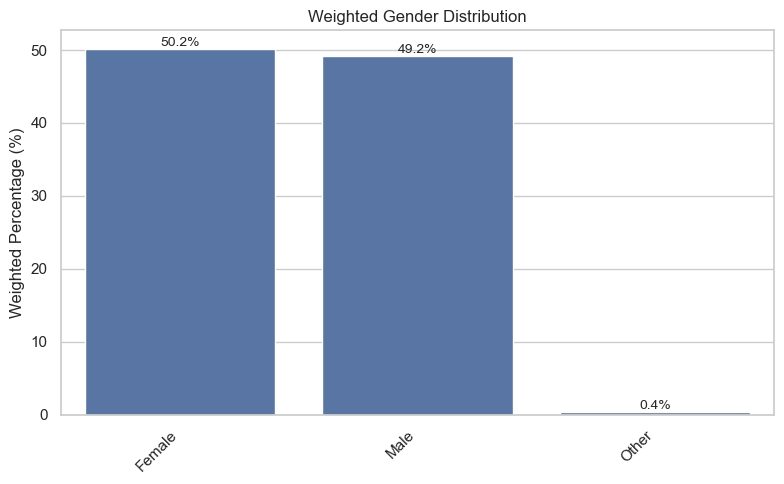
    


```python
weighted_frequency(df, "MEMS7GR_ALL")
```


<div>
<style scoped>
    .dataframe tbody tr th:only-of-type {
        vertical-align: middle;
    }

    .dataframe tbody tr th {
        vertical-align: top;
    }

    .dataframe thead th {
        text-align: right;
    }
</style>
<table border="1" class="dataframe">
  <thead>
    <tr style="text-align: right;">
      <th></th>
      <th>MEMS7GR_ALL</th>
      <th>Weighted_Count</th>
      <th>Weighted_Percent</th>
    </tr>
  </thead>
  <tbody>
    <tr>
      <th>0</th>
      <td>Active</td>
      <td>148813</td>
      <td>65.53</td>
    </tr>
    <tr>
      <th>1</th>
      <td>Inactive</td>
      <td>52265</td>
      <td>23.01</td>
    </tr>
    <tr>
      <th>2</th>
      <td>Fairly Active</td>
      <td>26029</td>
      <td>11.46</td>
    </tr>
  </tbody>
</table>
</div>


```python
plot_weighted_distribution(
    df,
    "MEMS7GR_ALL",
    title="Overall Weighted Activity Level",
    figsize=(7,5)
)
```


    
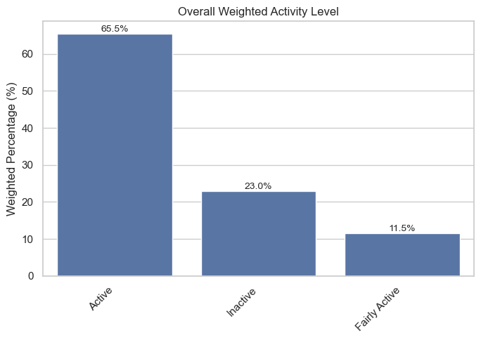
    


```python
# ==========================================================
# Weighted Activity Level by Year
# ==========================================================

activity_by_year = (
    df.groupby(["survey_year", "MEMS7GR_ALL"])["wt_final"]
      .sum()
      .reset_index(name="Weighted_Count")
)

# Convert to percentages within each year
activity_by_year["Weighted_Percent"] = (
    activity_by_year.groupby("survey_year")["Weighted_Count"]
                    .transform(lambda x: x / x.sum() * 100)
)

activity_by_year
```


<div>
<style scoped>
    .dataframe tbody tr th:only-of-type {
        vertical-align: middle;
    }

    .dataframe tbody tr th {
        vertical-align: top;
    }

    .dataframe thead th {
        text-align: right;
    }
</style>
<table border="1" class="dataframe">
  <thead>
    <tr style="text-align: right;">
      <th></th>
      <th>survey_year</th>
      <th>MEMS7GR_ALL</th>
      <th>Weighted_Count</th>
      <th>Weighted_Percent</th>
    </tr>
  </thead>
  <tbody>
    <tr>
      <th>0</th>
      <td>2015-16</td>
      <td>Active</td>
      <td>19713.682885</td>
      <td>64.621193</td>
    </tr>
    <tr>
      <th>1</th>
      <td>2015-16</td>
      <td>Fairly Active</td>
      <td>4017.095678</td>
      <td>13.167987</td>
    </tr>
    <tr>
      <th>2</th>
      <td>2015-16</td>
      <td>Inactive</td>
      <td>6775.750317</td>
      <td>22.210820</td>
    </tr>
    <tr>
      <th>3</th>
      <td>2016-17</td>
      <td>Active</td>
      <td>19210.152034</td>
      <td>63.253420</td>
    </tr>
    <tr>
      <th>4</th>
      <td>2016-17</td>
      <td>Fairly Active</td>
      <td>4200.082061</td>
      <td>13.829643</td>
    </tr>
    <tr>
      <th>5</th>
      <td>2016-17</td>
      <td>Inactive</td>
      <td>6959.905793</td>
      <td>22.916937</td>
    </tr>
    <tr>
      <th>6</th>
      <td>2017-18</td>
      <td>Active</td>
      <td>18709.676352</td>
      <td>66.834445</td>
    </tr>
    <tr>
      <th>7</th>
      <td>2017-18</td>
      <td>Fairly Active</td>
      <td>3164.064904</td>
      <td>11.302629</td>
    </tr>
    <tr>
      <th>8</th>
      <td>2017-18</td>
      <td>Inactive</td>
      <td>6120.321267</td>
      <td>21.862926</td>
    </tr>
    <tr>
      <th>9</th>
      <td>2018-19</td>
      <td>Active</td>
      <td>18925.959232</td>
      <td>66.735528</td>
    </tr>
    <tr>
      <th>10</th>
      <td>2018-19</td>
      <td>Fairly Active</td>
      <td>3231.541681</td>
      <td>11.394859</td>
    </tr>
    <tr>
      <th>11</th>
      <td>2018-19</td>
      <td>Inactive</td>
      <td>6202.144546</td>
      <td>21.869612</td>
    </tr>
    <tr>
      <th>12</th>
      <td>2019-20</td>
      <td>Active</td>
      <td>18080.926956</td>
      <td>65.117484</td>
    </tr>
    <tr>
      <th>13</th>
      <td>2019-20</td>
      <td>Fairly Active</td>
      <td>2989.967347</td>
      <td>10.768206</td>
    </tr>
    <tr>
      <th>14</th>
      <td>2019-20</td>
      <td>Inactive</td>
      <td>6695.729567</td>
      <td>24.114309</td>
    </tr>
    <tr>
      <th>15</th>
      <td>2020-21</td>
      <td>Active</td>
      <td>18002.158386</td>
      <td>64.943841</td>
    </tr>
    <tr>
      <th>16</th>
      <td>2020-21</td>
      <td>Fairly Active</td>
      <td>2957.957806</td>
      <td>10.671006</td>
    </tr>
    <tr>
      <th>17</th>
      <td>2020-21</td>
      <td>Inactive</td>
      <td>6759.461595</td>
      <td>24.385154</td>
    </tr>
    <tr>
      <th>18</th>
      <td>2021-22</td>
      <td>Active</td>
      <td>18467.933382</td>
      <td>66.571923</td>
    </tr>
    <tr>
      <th>19</th>
      <td>2021-22</td>
      <td>Fairly Active</td>
      <td>2859.648436</td>
      <td>10.308262</td>
    </tr>
    <tr>
      <th>20</th>
      <td>2021-22</td>
      <td>Inactive</td>
      <td>6413.742847</td>
      <td>23.119815</td>
    </tr>
    <tr>
      <th>21</th>
      <td>2022-23</td>
      <td>Active</td>
      <td>17702.718282</td>
      <td>66.427304</td>
    </tr>
    <tr>
      <th>22</th>
      <td>2022-23</td>
      <td>Fairly Active</td>
      <td>2609.118695</td>
      <td>9.790402</td>
    </tr>
    <tr>
      <th>23</th>
      <td>2022-23</td>
      <td>Inactive</td>
      <td>6337.924906</td>
      <td>23.782295</td>
    </tr>
  </tbody>
</table>
</div>


```python
# ==========================================================
# Reshape for plotting
# ==========================================================

activity_year_plot = activity_by_year.pivot(
    index="survey_year",
    columns="MEMS7GR_ALL",
    values="Weighted_Percent"
)
activity_by_year["Weighted_Percent"] = activity_by_year["Weighted_Percent"].round(2)
activity_year_plot
```


<div>
<style scoped>
    .dataframe tbody tr th:only-of-type {
        vertical-align: middle;
    }

    .dataframe tbody tr th {
        vertical-align: top;
    }

    .dataframe thead th {
        text-align: right;
    }
</style>
<table border="1" class="dataframe">
  <thead>
    <tr style="text-align: right;">
      <th>MEMS7GR_ALL</th>
      <th>Active</th>
      <th>Fairly Active</th>
      <th>Inactive</th>
    </tr>
    <tr>
      <th>survey_year</th>
      <th></th>
      <th></th>
      <th></th>
    </tr>
  </thead>
  <tbody>
    <tr>
      <th>2015-16</th>
      <td>64.62</td>
      <td>13.17</td>
      <td>22.21</td>
    </tr>
    <tr>
      <th>2016-17</th>
      <td>63.25</td>
      <td>13.83</td>
      <td>22.92</td>
    </tr>
    <tr>
      <th>2017-18</th>
      <td>66.83</td>
      <td>11.30</td>
      <td>21.86</td>
    </tr>
    <tr>
      <th>2018-19</th>
      <td>66.74</td>
      <td>11.39</td>
      <td>21.87</td>
    </tr>
    <tr>
      <th>2019-20</th>
      <td>65.12</td>
      <td>10.77</td>
      <td>24.11</td>
    </tr>
    <tr>
      <th>2020-21</th>
      <td>64.94</td>
      <td>10.67</td>
      <td>24.39</td>
    </tr>
    <tr>
      <th>2021-22</th>
      <td>66.57</td>
      <td>10.31</td>
      <td>23.12</td>
    </tr>
    <tr>
      <th>2022-23</th>
      <td>66.43</td>
      <td>9.79</td>
      <td>23.78</td>
    </tr>
  </tbody>
</table>
</div>


```python
# ==========================================================
# Weighted Activity Level by Year
# ==========================================================

plt.figure(figsize=(10,6))

plt.plot(
    activity_year_plot.index,
    activity_year_plot["Active"],
    marker="o",
    linewidth=2.5,
    color="forestgreen",
    label="Active"
)

plt.plot(
    activity_year_plot.index,
    activity_year_plot["Fairly Active"],
    marker="o",
    linewidth=2.5,
    color="darkorange",
    label="Fairly Active"
)

plt.plot(
    activity_year_plot.index,
    activity_year_plot["Inactive"],
    marker="o",
    linewidth=2.5,
    color="firebrick",
    label="Inactive"
)

plt.title("Weighted Activity Level by Survey Year")

plt.xlabel("Survey Year")
plt.ylabel("Weighted Percentage (%)")

plt.xticks(rotation=45)

plt.legend(title="Activity Level")

plt.grid(alpha=0.3)

plt.tight_layout()

plt.show()
```


    
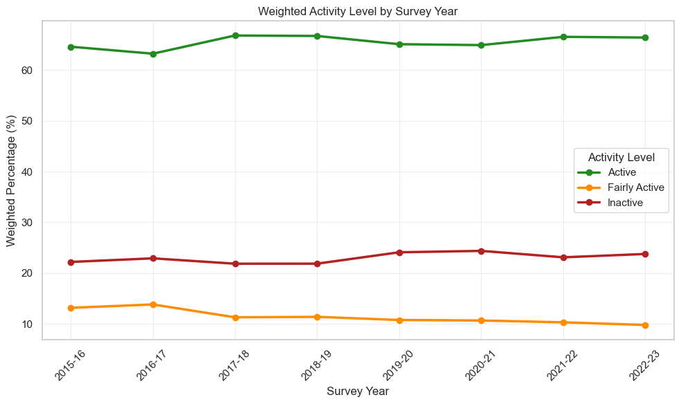
    


```python
# ==========================================================
# Weighted Activity Level by Borough
# ==========================================================

activity_by_borough = (
    df.groupby(["borough", "MEMS7GR_ALL"])["wt_final"]
      .sum()
      .reset_index(name="Weighted_Count")
)

activity_by_borough["Weighted_Percent"] = (
    activity_by_borough.groupby("borough")["Weighted_Count"]
                       .transform(lambda x: x / x.sum() * 100)
)

activity_by_borough["Weighted_Percent"] = (
    activity_by_borough["Weighted_Percent"].round(2)
)

activity_by_borough.head()
```


<div>
<style scoped>
    .dataframe tbody tr th:only-of-type {
        vertical-align: middle;
    }

    .dataframe tbody tr th {
        vertical-align: top;
    }

    .dataframe thead th {
        text-align: right;
    }
</style>
<table border="1" class="dataframe">
  <thead>
    <tr style="text-align: right;">
      <th></th>
      <th>borough</th>
      <th>MEMS7GR_ALL</th>
      <th>Weighted_Count</th>
      <th>Weighted_Percent</th>
    </tr>
  </thead>
  <tbody>
    <tr>
      <th>0</th>
      <td>Barking and Dagenham</td>
      <td>Active</td>
      <td>2701.834801</td>
      <td>54.13</td>
    </tr>
    <tr>
      <th>1</th>
      <td>Barking and Dagenham</td>
      <td>Fairly Active</td>
      <td>566.115315</td>
      <td>11.34</td>
    </tr>
    <tr>
      <th>2</th>
      <td>Barking and Dagenham</td>
      <td>Inactive</td>
      <td>1723.686132</td>
      <td>34.53</td>
    </tr>
    <tr>
      <th>3</th>
      <td>Barnet</td>
      <td>Active</td>
      <td>6339.722178</td>
      <td>63.91</td>
    </tr>
    <tr>
      <th>4</th>
      <td>Barnet</td>
      <td>Fairly Active</td>
      <td>1280.626502</td>
      <td>12.91</td>
    </tr>
  </tbody>
</table>
</div>


```python
borough_plot = activity_by_borough.pivot(
    index="borough",
    columns="MEMS7GR_ALL",
    values="Weighted_Percent"
)

borough_plot.head()
```


<div>
<style scoped>
    .dataframe tbody tr th:only-of-type {
        vertical-align: middle;
    }

    .dataframe tbody tr th {
        vertical-align: top;
    }

    .dataframe thead th {
        text-align: right;
    }
</style>
<table border="1" class="dataframe">
  <thead>
    <tr style="text-align: right;">
      <th>MEMS7GR_ALL</th>
      <th>Active</th>
      <th>Fairly Active</th>
      <th>Inactive</th>
    </tr>
    <tr>
      <th>borough</th>
      <th></th>
      <th></th>
      <th></th>
    </tr>
  </thead>
  <tbody>
    <tr>
      <th>Barking and Dagenham</th>
      <td>54.13</td>
      <td>11.34</td>
      <td>34.53</td>
    </tr>
    <tr>
      <th>Barnet</th>
      <td>63.91</td>
      <td>12.91</td>
      <td>23.18</td>
    </tr>
    <tr>
      <th>Bexley</th>
      <td>63.39</td>
      <td>12.36</td>
      <td>24.25</td>
    </tr>
    <tr>
      <th>Brent</th>
      <td>58.71</td>
      <td>12.37</td>
      <td>28.92</td>
    </tr>
    <tr>
      <th>Bromley</th>
      <td>70.73</td>
      <td>10.62</td>
      <td>18.65</td>
    </tr>
  </tbody>
</table>
</div>


```python
plt.figure(figsize=(14,10))

borough_plot[
    ["Inactive", "Fairly Active", "Active"]
].plot(
    kind="barh",
    stacked=True,
    figsize=(14,10),
    color=["firebrick","darkorange","forestgreen"]
)

plt.xlabel("Weighted Percentage (%)")
plt.ylabel("London Borough")
plt.title("Weighted Activity Level by Borough")

plt.legend(title="Activity Level",
           bbox_to_anchor=(1.02,1),
           loc="upper left")

plt.tight_layout()

plt.show()
```


    <Figure size 1400x1000 with 0 Axes>


    
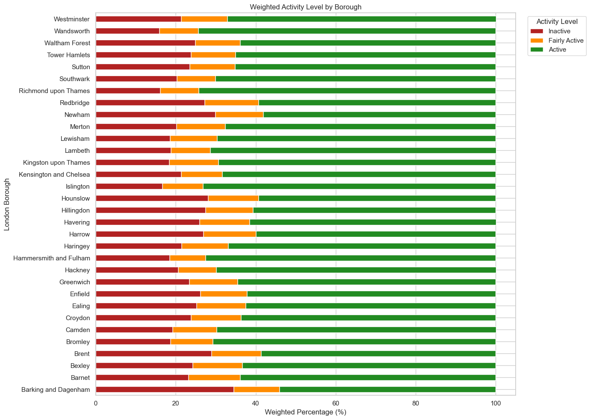
    


```python
# ==========================================================
# Ranked Active Boroughs
# ==========================================================

active_borough = (
    activity_by_borough[
        activity_by_borough["MEMS7GR_ALL"] == "Active"
    ]
    .sort_values("Weighted_Percent", ascending=False)
)

active_borough.head()
```


<div>
<style scoped>
    .dataframe tbody tr th:only-of-type {
        vertical-align: middle;
    }

    .dataframe tbody tr th {
        vertical-align: top;
    }

    .dataframe thead th {
        text-align: right;
    }
</style>
<table border="1" class="dataframe">
  <thead>
    <tr style="text-align: right;">
      <th></th>
      <th>borough</th>
      <th>MEMS7GR_ALL</th>
      <th>Weighted_Count</th>
      <th>Weighted_Percent</th>
    </tr>
  </thead>
  <tbody>
    <tr>
      <th>90</th>
      <td>Wandsworth</td>
      <td>Active</td>
      <td>6426.599275</td>
      <td>74.41</td>
    </tr>
    <tr>
      <th>75</th>
      <td>Richmond upon Thames</td>
      <td>Active</td>
      <td>3785.879220</td>
      <td>74.31</td>
    </tr>
    <tr>
      <th>51</th>
      <td>Islington</td>
      <td>Active</td>
      <td>4670.729172</td>
      <td>73.23</td>
    </tr>
    <tr>
      <th>33</th>
      <td>Hammersmith and Fulham</td>
      <td>Active</td>
      <td>3546.762488</td>
      <td>72.55</td>
    </tr>
    <tr>
      <th>60</th>
      <td>Lambeth</td>
      <td>Active</td>
      <td>6119.969571</td>
      <td>71.36</td>
    </tr>
  </tbody>
</table>
</div>


```python
# ==========================================================
# Active Population by Borough
# ==========================================================

plt.figure(figsize=(10,10))

ax = sns.barplot(
    data=active_borough,
    y="borough",
    x="Weighted_Percent",
    color="forestgreen"
)

# Percentage labels
for p in ax.patches:
    ax.annotate(
        f"{p.get_width():.1f}%",
        (p.get_width()+0.2,
         p.get_y()+p.get_height()/2),
        va="center",
        fontsize=9
    )

plt.title("Weighted Active Population by Borough")

plt.xlabel("Weighted Percentage (%)")
plt.ylabel("London Borough")

plt.xlim(0, active_borough["Weighted_Percent"].max() + 5)

plt.tight_layout()

plt.show()
```


    
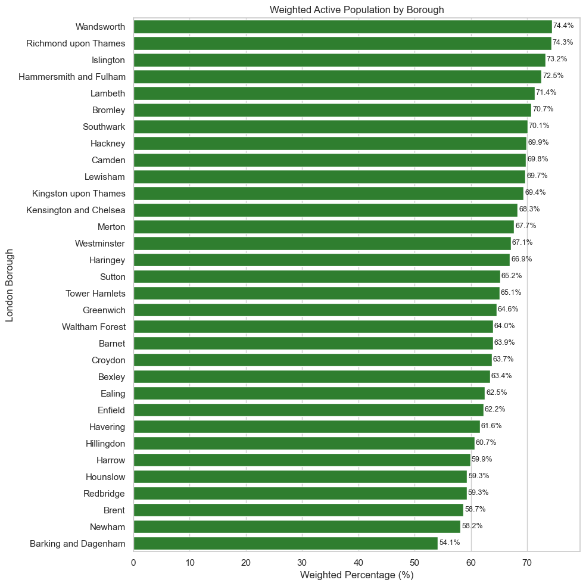
    


```python
# ==========================================================
# Ranked Inactive Boroughs
# ==========================================================

inactive_borough = (
    activity_by_borough[
        activity_by_borough["MEMS7GR_ALL"] == "Inactive"
    ]
    .sort_values("Weighted_Percent", ascending=False)
)

plt.figure(figsize=(11,12))

ax = sns.barplot(
    data=inactive_borough,
    y="borough",
    x="Weighted_Percent",
    color="firebrick"
)

for p in ax.patches:
    ax.annotate(
        f"{p.get_width():.1f}%",
        (p.get_width()+0.2,
         p.get_y()+p.get_height()/2),
        va="center",
        fontsize=9
    )

plt.title("Weighted Inactive Population by Borough")

plt.xlabel("Weighted Percentage (%)")
plt.ylabel("London Borough")

plt.xlim(0, inactive_borough["Weighted_Percent"].max() + 5)

plt.tight_layout()
plt.show()
```


    
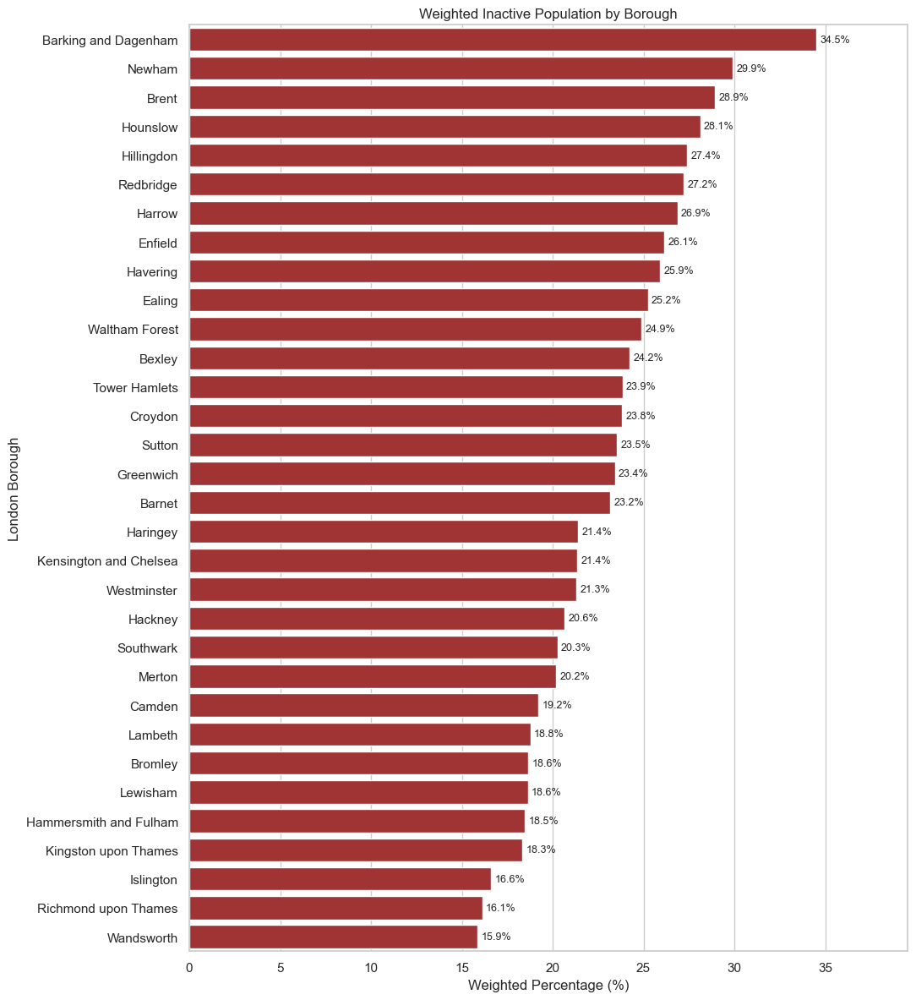
    


```python
gender = weighted_frequency(df, "Gend3")

gender
```


<div>
<style scoped>
    .dataframe tbody tr th:only-of-type {
        vertical-align: middle;
    }

    .dataframe tbody tr th {
        vertical-align: top;
    }

    .dataframe thead th {
        text-align: right;
    }
</style>
<table border="1" class="dataframe">
  <thead>
    <tr style="text-align: right;">
      <th></th>
      <th>Gend3</th>
      <th>Weighted_Count</th>
      <th>Weighted_Percent</th>
    </tr>
  </thead>
  <tbody>
    <tr>
      <th>0</th>
      <td>Female</td>
      <td>113955</td>
      <td>50.18</td>
    </tr>
    <tr>
      <th>1</th>
      <td>Male</td>
      <td>111793</td>
      <td>49.22</td>
    </tr>
    <tr>
      <th>2</th>
      <td>Other</td>
      <td>897</td>
      <td>0.39</td>
    </tr>
    <tr>
      <th>3</th>
      <td>NaN</td>
      <td>463</td>
      <td>0.20</td>
    </tr>
  </tbody>
</table>
</div>


```python
# ==========================================================
# Weighted Gender Distribution
# ==========================================================

gender = weighted_frequency(df, "Gend3")

display(gender)
```


<div>
<style scoped>
    .dataframe tbody tr th:only-of-type {
        vertical-align: middle;
    }

    .dataframe tbody tr th {
        vertical-align: top;
    }

    .dataframe thead th {
        text-align: right;
    }
</style>
<table border="1" class="dataframe">
  <thead>
    <tr style="text-align: right;">
      <th></th>
      <th>Gend3</th>
      <th>Weighted_Count</th>
      <th>Weighted_Percent</th>
    </tr>
  </thead>
  <tbody>
    <tr>
      <th>0</th>
      <td>Female</td>
      <td>113955</td>
      <td>50.18</td>
    </tr>
    <tr>
      <th>1</th>
      <td>Male</td>
      <td>111793</td>
      <td>49.22</td>
    </tr>
    <tr>
      <th>2</th>
      <td>Other</td>
      <td>897</td>
      <td>0.39</td>
    </tr>
    <tr>
      <th>3</th>
      <td>NaN</td>
      <td>463</td>
      <td>0.20</td>
    </tr>
  </tbody>
</table>
</div>


```python
gender_df = df[df["Gend3"].isin(["Female", "Male"])]
plot_weighted_distribution(
    gender_df,
    "Gend3",
    title="Weighted Gender Distribution",
    figsize=(7,5)
)
```


    
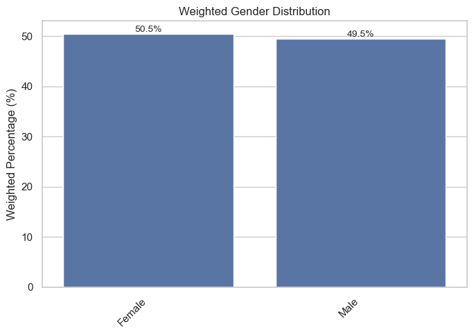
    


```python
# ==========================================================
# Weighted Ethnicity Distribution
# ==========================================================

ethnicity = weighted_frequency(df, "Eth7")

display(ethnicity)
ethnicity_df = df[df["Eth7"].notna()]
plot_weighted_distribution(
    ethnicity_df,
    "Eth7",
    title="Weighted Ethnicity Distribution",
    figsize=(10,6)
)
```


<div>
<style scoped>
    .dataframe tbody tr th:only-of-type {
        vertical-align: middle;
    }

    .dataframe tbody tr th {
        vertical-align: top;
    }

    .dataframe thead th {
        text-align: right;
    }
</style>
<table border="1" class="dataframe">
  <thead>
    <tr style="text-align: right;">
      <th></th>
      <th>Eth7</th>
      <th>Weighted_Count</th>
      <th>Weighted_Percent</th>
    </tr>
  </thead>
  <tbody>
    <tr>
      <th>0</th>
      <td>White British</td>
      <td>98097</td>
      <td>43.19</td>
    </tr>
    <tr>
      <th>1</th>
      <td>South Asian</td>
      <td>41968</td>
      <td>18.48</td>
    </tr>
    <tr>
      <th>2</th>
      <td>White Other</td>
      <td>32018</td>
      <td>14.10</td>
    </tr>
    <tr>
      <th>3</th>
      <td>Black</td>
      <td>18559</td>
      <td>8.17</td>
    </tr>
    <tr>
      <th>4</th>
      <td>NaN</td>
      <td>14235</td>
      <td>6.27</td>
    </tr>
    <tr>
      <th>5</th>
      <td>Mixed</td>
      <td>9188</td>
      <td>4.05</td>
    </tr>
    <tr>
      <th>6</th>
      <td>Other ethnic group</td>
      <td>8062</td>
      <td>3.55</td>
    </tr>
    <tr>
      <th>7</th>
      <td>Chinese</td>
      <td>4980</td>
      <td>2.19</td>
    </tr>
  </tbody>
</table>
</div>


    
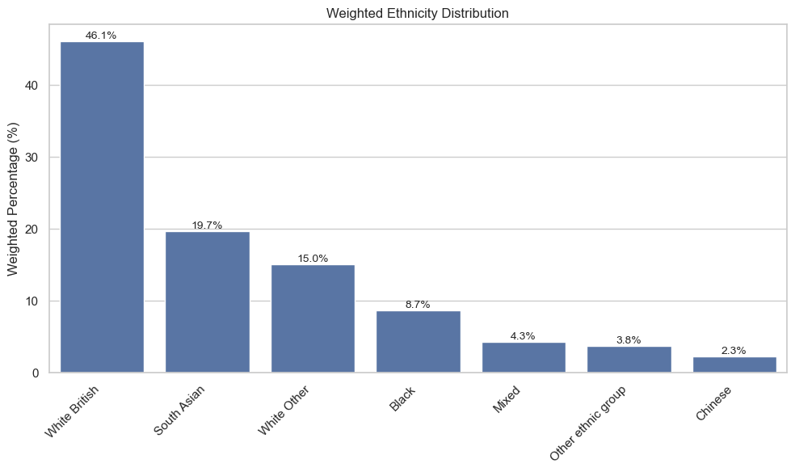
    


```python
# ==========================================================
# Weighted General Health Distribution
# ==========================================================

health_df = df[df["health"].notna()]

health = weighted_frequency(health_df, "health")

# Logical order
order = [
    "Very good",
    "Good",
    "Fair",
    "Bad",
    "Very bad"
]

health["health"] = pd.Categorical(
    health["health"],
    categories=order,
    ordered=True
)

health = health.sort_values("health")

display(health)

plt.figure(figsize=(8,5))

ax = sns.barplot(
    data=health,
    x="health",
    y="Weighted_Percent",
    color="steelblue"
)

for p in ax.patches:
    ax.annotate(
        f"{p.get_height():.1f}%",
        (p.get_x() + p.get_width()/2, p.get_height()),
        ha="center",
        va="bottom",
        fontsize=10
    )

plt.title("Weighted General Health Distribution")
plt.xlabel("")
plt.ylabel("Weighted Percentage (%)")

plt.xticks(rotation=45)

plt.tight_layout()
plt.show()
```


<div>
<style scoped>
    .dataframe tbody tr th:only-of-type {
        vertical-align: middle;
    }

    .dataframe tbody tr th {
        vertical-align: top;
    }

    .dataframe thead th {
        text-align: right;
    }
</style>
<table border="1" class="dataframe">
  <thead>
    <tr style="text-align: right;">
      <th></th>
      <th>health</th>
      <th>Weighted_Count</th>
      <th>Weighted_Percent</th>
    </tr>
  </thead>
  <tbody>
    <tr>
      <th>2</th>
      <td>Very good</td>
      <td>30720</td>
      <td>22.67</td>
    </tr>
    <tr>
      <th>0</th>
      <td>Good</td>
      <td>66508</td>
      <td>49.07</td>
    </tr>
    <tr>
      <th>1</th>
      <td>Fair</td>
      <td>31188</td>
      <td>23.01</td>
    </tr>
    <tr>
      <th>3</th>
      <td>Bad</td>
      <td>5566</td>
      <td>4.11</td>
    </tr>
    <tr>
      <th>4</th>
      <td>Very bad</td>
      <td>1548</td>
      <td>1.14</td>
    </tr>
  </tbody>
</table>
</div>


    
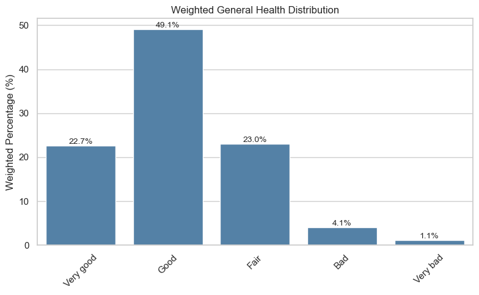
    


```python
# ==========================================================
# Weighted Disability Distribution
# ==========================================================

disability = weighted_frequency(df, "Disab2_POP")

display(disability)

plot_weighted_distribution(
    df,
    "Disab2_POP",
    title="Weighted Disability Distribution",
    figsize=(8,5)
)
```


<div>
<style scoped>
    .dataframe tbody tr th:only-of-type {
        vertical-align: middle;
    }

    .dataframe tbody tr th {
        vertical-align: top;
    }

    .dataframe thead th {
        text-align: right;
    }
</style>
<table border="1" class="dataframe">
  <thead>
    <tr style="text-align: right;">
      <th></th>
      <th>Disab2_POP</th>
      <th>Weighted_Count</th>
      <th>Weighted_Percent</th>
    </tr>
  </thead>
  <tbody>
    <tr>
      <th>0</th>
      <td>No disability</td>
      <td>181598</td>
      <td>79.96</td>
    </tr>
    <tr>
      <th>1</th>
      <td>Disability</td>
      <td>30129</td>
      <td>13.27</td>
    </tr>
    <tr>
      <th>2</th>
      <td>NaN</td>
      <td>15381</td>
      <td>6.77</td>
    </tr>
  </tbody>
</table>
</div>


    
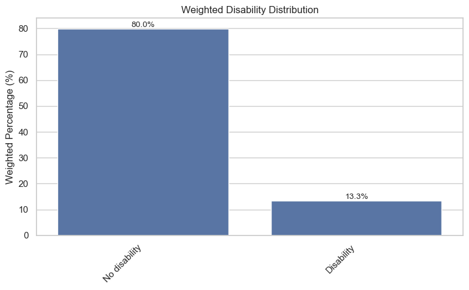
    


```python
# ==========================================================
# Weighted Disability Distribution
# ==========================================================

disability = weighted_frequency(df, "Disab3")

display(disability)

plot_weighted_distribution(
    df,
    "Disab3",
    title="Weighted Disability Distribution",
    figsize=(8,5)
)
```


<div>
<style scoped>
    .dataframe tbody tr th:only-of-type {
        vertical-align: middle;
    }

    .dataframe tbody tr th {
        vertical-align: top;
    }

    .dataframe thead th {
        text-align: right;
    }
</style>
<table border="1" class="dataframe">
  <thead>
    <tr style="text-align: right;">
      <th></th>
      <th>Disab3</th>
      <th>Weighted_Count</th>
      <th>Weighted_Percent</th>
    </tr>
  </thead>
  <tbody>
    <tr>
      <th>0</th>
      <td>No disability</td>
      <td>149557</td>
      <td>65.85</td>
    </tr>
    <tr>
      <th>1</th>
      <td>Non-limiting disability</td>
      <td>32041</td>
      <td>14.11</td>
    </tr>
    <tr>
      <th>2</th>
      <td>Limiting disability</td>
      <td>30129</td>
      <td>13.27</td>
    </tr>
    <tr>
      <th>3</th>
      <td>NaN</td>
      <td>15381</td>
      <td>6.77</td>
    </tr>
  </tbody>
</table>
</div>


    
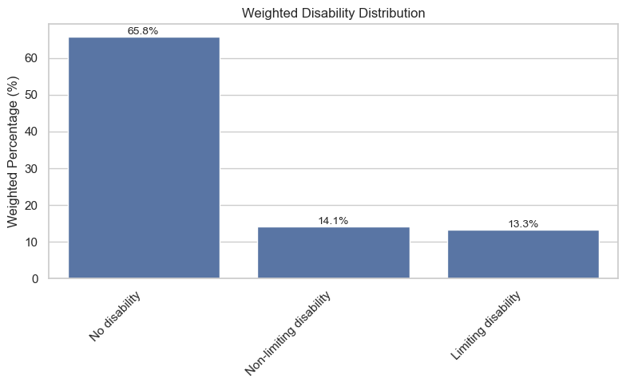
    


```python
# ==========================================================
# Weighted Education Distribution
# ==========================================================

education_df = df[df["Educ6"].notna()]

education = weighted_frequency(education_df, "Educ6")

order = [
    "No qualifications",
    "Level 1 and below",
    "Level 2 and equivalents",
    "Level 3 and equivalents",
    "Level 4 or above",
    "Another type of qualification"
]

education["Educ6"] = pd.Categorical(
    education["Educ6"],
    categories=order,
    ordered=True
)

education = education.sort_values("Educ6")

display(education)

plt.figure(figsize=(10,6))

ax = sns.barplot(
    data=education,
    x="Educ6",
    y="Weighted_Percent",
    color="steelblue"
)

for p in ax.patches:
    ax.annotate(
        f"{p.get_height():.1f}%",
        (p.get_x() + p.get_width()/2, p.get_height()),
        ha="center",
        va="bottom",
        fontsize=10
    )

plt.title("Weighted Education Distribution")
plt.xlabel("")
plt.ylabel("Weighted Percentage (%)")

plt.xticks(rotation=45, ha="right")

plt.tight_layout()
plt.show()
```


<div>
<style scoped>
    .dataframe tbody tr th:only-of-type {
        vertical-align: middle;
    }

    .dataframe tbody tr th {
        vertical-align: top;
    }

    .dataframe thead th {
        text-align: right;
    }
</style>
<table border="1" class="dataframe">
  <thead>
    <tr style="text-align: right;">
      <th></th>
      <th>Educ6</th>
      <th>Weighted_Count</th>
      <th>Weighted_Percent</th>
    </tr>
  </thead>
  <tbody>
    <tr>
      <th>3</th>
      <td>No qualifications</td>
      <td>12507</td>
      <td>5.87</td>
    </tr>
    <tr>
      <th>5</th>
      <td>Level 1 and below</td>
      <td>4583</td>
      <td>2.15</td>
    </tr>
    <tr>
      <th>2</th>
      <td>Level 2 and equivalents</td>
      <td>28661</td>
      <td>13.45</td>
    </tr>
    <tr>
      <th>1</th>
      <td>Level 3 and equivalents</td>
      <td>30949</td>
      <td>14.52</td>
    </tr>
    <tr>
      <th>0</th>
      <td>Level 4 or above</td>
      <td>125210</td>
      <td>58.76</td>
    </tr>
    <tr>
      <th>4</th>
      <td>Another type of qualification</td>
      <td>11195</td>
      <td>5.25</td>
    </tr>
  </tbody>
</table>
</div>


    
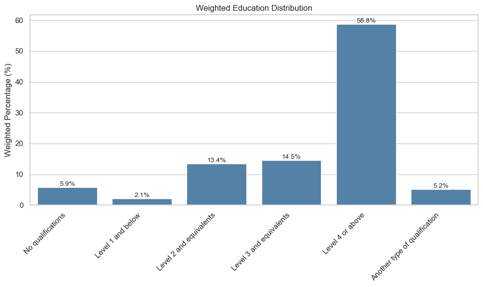
    


```python
# ==========================================================
# Weighted Volunteering Rate by Year
# ==========================================================

volunteering_by_year = (
    df.groupby(["survey_year", "VolAny"])["wt_final"]
      .sum()
      .reset_index(name="Weighted_Count")
)

volunteering_by_year["Weighted_Percent"] = (
    volunteering_by_year.groupby("survey_year")["Weighted_Count"]
                        .transform(lambda x: x / x.sum() * 100)
)

volunteering_by_year["Weighted_Percent"] = (
    volunteering_by_year["Weighted_Percent"].round(2)
)

display(volunteering_by_year)
```


<div>
<style scoped>
    .dataframe tbody tr th:only-of-type {
        vertical-align: middle;
    }

    .dataframe tbody tr th {
        vertical-align: top;
    }

    .dataframe thead th {
        text-align: right;
    }
</style>
<table border="1" class="dataframe">
  <thead>
    <tr style="text-align: right;">
      <th></th>
      <th>survey_year</th>
      <th>VolAny</th>
      <th>Weighted_Count</th>
      <th>Weighted_Percent</th>
    </tr>
  </thead>
  <tbody>
    <tr>
      <th>0</th>
      <td>2016-17</td>
      <td>No</td>
      <td>14902.137885</td>
      <td>77.07</td>
    </tr>
    <tr>
      <th>1</th>
      <td>2016-17</td>
      <td>Yes</td>
      <td>4433.279161</td>
      <td>22.93</td>
    </tr>
    <tr>
      <th>2</th>
      <td>2017-18</td>
      <td>No</td>
      <td>13466.111257</td>
      <td>78.16</td>
    </tr>
    <tr>
      <th>3</th>
      <td>2017-18</td>
      <td>Yes</td>
      <td>3761.825269</td>
      <td>21.84</td>
    </tr>
    <tr>
      <th>4</th>
      <td>2018-19</td>
      <td>No</td>
      <td>14717.733724</td>
      <td>84.02</td>
    </tr>
    <tr>
      <th>5</th>
      <td>2018-19</td>
      <td>Yes</td>
      <td>2798.692847</td>
      <td>15.98</td>
    </tr>
    <tr>
      <th>6</th>
      <td>2019-20</td>
      <td>No</td>
      <td>22106.904797</td>
      <td>81.61</td>
    </tr>
    <tr>
      <th>7</th>
      <td>2019-20</td>
      <td>Yes</td>
      <td>4981.165835</td>
      <td>18.39</td>
    </tr>
    <tr>
      <th>8</th>
      <td>2020-21</td>
      <td>No</td>
      <td>18964.071371</td>
      <td>87.66</td>
    </tr>
    <tr>
      <th>9</th>
      <td>2020-21</td>
      <td>Yes</td>
      <td>2669.851752</td>
      <td>12.34</td>
    </tr>
    <tr>
      <th>10</th>
      <td>2021-22</td>
      <td>No</td>
      <td>17952.173203</td>
      <td>83.26</td>
    </tr>
    <tr>
      <th>11</th>
      <td>2021-22</td>
      <td>Yes</td>
      <td>3609.453169</td>
      <td>16.74</td>
    </tr>
    <tr>
      <th>12</th>
      <td>2022-23</td>
      <td>No</td>
      <td>17484.415322</td>
      <td>81.70</td>
    </tr>
    <tr>
      <th>13</th>
      <td>2022-23</td>
      <td>Yes</td>
      <td>3915.125440</td>
      <td>18.30</td>
    </tr>
  </tbody>
</table>
</div>


```python
volunteer_plot = volunteering_by_year.pivot(
    index="survey_year",
    columns="VolAny",
    values="Weighted_Percent"
)

display(volunteer_plot)
```


<div>
<style scoped>
    .dataframe tbody tr th:only-of-type {
        vertical-align: middle;
    }

    .dataframe tbody tr th {
        vertical-align: top;
    }

    .dataframe thead th {
        text-align: right;
    }
</style>
<table border="1" class="dataframe">
  <thead>
    <tr style="text-align: right;">
      <th>VolAny</th>
      <th>No</th>
      <th>Yes</th>
    </tr>
    <tr>
      <th>survey_year</th>
      <th></th>
      <th></th>
    </tr>
  </thead>
  <tbody>
    <tr>
      <th>2016-17</th>
      <td>77.07</td>
      <td>22.93</td>
    </tr>
    <tr>
      <th>2017-18</th>
      <td>78.16</td>
      <td>21.84</td>
    </tr>
    <tr>
      <th>2018-19</th>
      <td>84.02</td>
      <td>15.98</td>
    </tr>
    <tr>
      <th>2019-20</th>
      <td>81.61</td>
      <td>18.39</td>
    </tr>
    <tr>
      <th>2020-21</th>
      <td>87.66</td>
      <td>12.34</td>
    </tr>
    <tr>
      <th>2021-22</th>
      <td>83.26</td>
      <td>16.74</td>
    </tr>
    <tr>
      <th>2022-23</th>
      <td>81.70</td>
      <td>18.30</td>
    </tr>
  </tbody>
</table>
</div>


```python
plt.figure(figsize=(9,5))

if "Yes" in volunteer_plot.columns:
    plt.plot(
        volunteer_plot.index,
        volunteer_plot["Yes"],
        marker="o",
        linewidth=2,
        label="Volunteered"
    )

if "No" in volunteer_plot.columns:
    plt.plot(
        volunteer_plot.index,
        volunteer_plot["No"],
        marker="o",
        linewidth=2,
        label="Did not volunteer"
    )

plt.title("Weighted Volunteering Rate by Survey Year")

plt.xlabel("Survey Year")
plt.ylabel("Weighted Percentage (%)")

plt.legend(title="Volunteering")

plt.grid(axis="y", alpha=0.3)

plt.tight_layout()

plt.show()
```


    
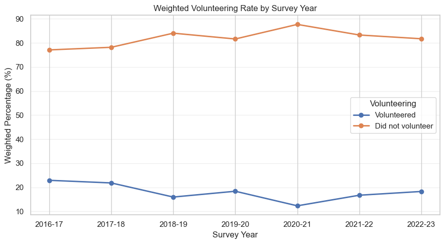
    


```python
plt.figure(figsize=(9,5))

plt.plot(
    volunteer_plot.index,
    volunteer_plot["Yes"],
    marker="o",
    linewidth=2.5,
    color="darkorange"
)

# Add percentage labels
for x, y in zip(volunteer_plot.index, volunteer_plot["Yes"]):
    plt.text(x, y + 0.5, f"{y:.1f}%", ha="center", fontsize=9)

plt.title("Weighted Volunteering Rate by Survey Year")
plt.xlabel("Survey Year")
plt.ylabel("Weighted Percentage (%)")

plt.ylim(0, 30)
plt.grid(axis="y", alpha=0.3)

plt.tight_layout()
plt.show()
```


    
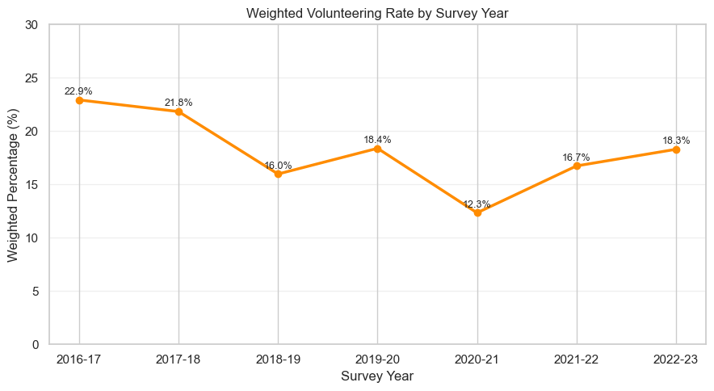
    


```python
## Key Findings

### Activity Levels
- Approximately two-thirds of London adults are classified as Active, while around one-quarter are Inactive.
- Overall activity levels remained relatively stable between 2015–16 and 2022–23.

### Borough Differences
- Borough-level variation was considerably larger than year-to-year variation.
- Wandsworth, Richmond upon Thames and Islington had the highest proportions of Active adults.
- Barking and Dagenham, Newham and Brent exhibited the highest levels of inactivity.

### Volunteering
- Around one-fifth of respondents reported volunteering.
- Volunteering participation declined during 2020–21, likely reflecting the impact of the COVID-19 pandemic, before showing signs of recovery in subsequent years.

### Demographic Profile
- The weighted survey population was almost evenly split between males and females.
- White British respondents formed the largest ethnic group.
- Most respondents reported no disability.
- More than half of respondents held Level 4 qualifications or above.
- General Health data are only available from 2018–19 onwards.
```
